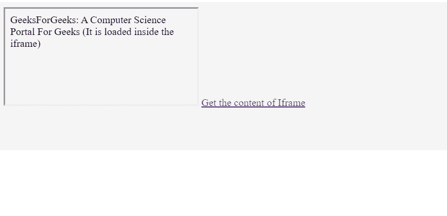
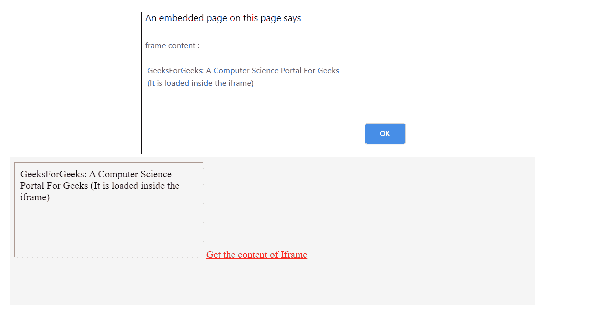

# 如何用 JavaScript 获取一个 iFrame 的 HTML 内容？

> 原文:[https://www . geesforgeks . org/how-to-html-content-of-iframe-use-JavaScript/](https://www.geeksforgeeks.org/how-to-get-html-content-of-an-iframe-using-javascript/)

[< iframe >标签](https://www.geeksforgeeks.org/html-iframes/)指定了一个内嵌框架。它允许我们将一个单独的 HTML 文件加载到现有的文档中。

**代码片段:**

```html
function getIframeContent(frameId) {
    var frameObj = 
        document.getElementById(frameId);

    var frameContent = frameObj.
        contentWindow.document.body.innerHTML;

    alert("frame content : " + frameContent);
}

```

一些定义如下:

*   **GetFrameContent(FrameID):**用于获取 iframe 的对象引用。
*   **contentWindow:** 是返回 iframe 的窗口对象的属性。
*   **contentWindow.document:** 返回 iframe 窗口的文档对象。
*   **content window . document . body . innerhtml:**返回 iframe body 的 HTML 内容。

**示例:**以下示例演示如何将单独的 HTML 文件包含到现有文档中。

```html
<!DOCTYPE html>
<html>

<head>
    <title>
        How to get HTML content of 
        an iFrame using javascript?
    </title>
</head>

<body>
    <iframe id="frameID" src=
        "ContentOfFrame.html">
    </iframe>

    <a href="#" onclick=
        "getIframeContent('frameID');">
        Get the content of Iframe
    </a>

    <script>
        function getIframeContent(frameID) {
            var frameObj = 
                document.getElementById(frameID);
            var frameContent = frameObj
                .contentWindow.document.body.innerHTML;

            alert("frame content : " + frameContent);
        }
    </script>
</body>

</html>
```

**ContentOfFrame.html**下面的例子演示了文件“ContentOfFrame.html”的 HTML 代码内容

```html
<!DOCTYPE html>
<html>

<body>
    GeeksForGeeks: A Computer 
    Science Portal For Geeks
    (It is loaded inside the 
    iframe)
</body>

</html>
```

**输出:**

*   **点击链接前:**
    
*   **点击链接后:**
    