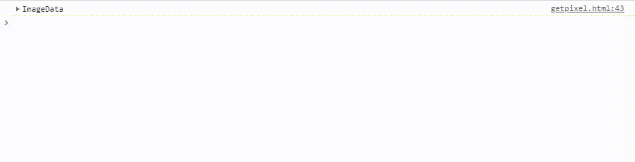
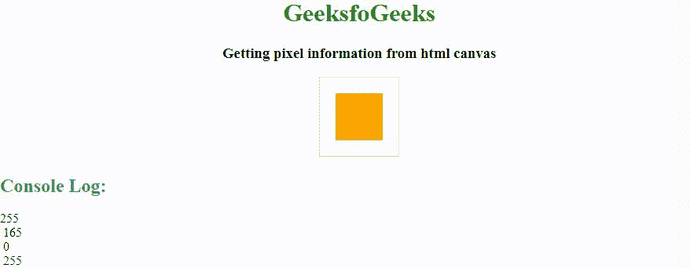

# 如何从 HTML 画布中获取 Pixel？

> 原文:[https://www . geesforgeks . org/如何从 html-canvas 中获取像素/](https://www.geeksforgeeks.org/how-to-get-pixel-from-html-canvas/)

要从 HTML 画布中获取任何特定部分的像素，可以使用 [HTML 画布 getImageData()方法](https://www.geeksforgeeks.org/html-canvas-getimagedata-method/)。 **getImageData()** 方法通常返回一个 ImageData 对象，该对象包含 HTML 画布上指定对象的像素信息。

**示例 1:** 本示例将显示方形框的每个像素值。盒子的颜色是线性渐变的，所以像素会改变同时改变的颜色值。

*   **程序:**

    ```
    <!DOCTYPE html>
    <html>

    <head>
        <title>
            Getting pixel information
            from html canvas.
        </title>
    </head>

    <body>
        <center>
            <h1 style="color:green;">
                GeeksfoGeeks
            </h1>

            <h3>
                Getting pixel information
                from html canvas
            </h3>

            <canvas id="GFG" width="190" height="100"
                    style="border:1px solid black;">
            </canvas>

            <script>

                /* Retrieve canvas with id GFG,
                    and store it in a */
                var a = document.getElementById("GFG");

                /* Retrieve a 2D context for the canvas */
                var gfg = a.getContext("2d");

                var geeks = 
                    gfg.createLinearGradient(0, 0, 200, 0);

                geeks.addColorStop(0, "green");
                geeks.addColorStop(1, "yellow");

                gfg.fillStyle = geeks;
                gfg.fillRect(20, 20, 150, 150);

                /* Define a function find(), that prints
                the array containing pixel information
                returned by the getImageData() method */
                function find() {

                    /* Store the pixel information of
                    the canvas at (x,y) coordinate of
                    (20,20) */
                    var ImageData = 
                        gfg.getImageData(20, 20, 60, 60);

                    /* Print the array on console */
                    console.log(ImageData);
                }

                find();
            </script>
        </center>
    </body>

    </html>
    ```

*   **输出:**
    

**例 2:** 获取第一个像素的颜色/阿尔法信息的代码。运行代码后，您可以通过更改第 36 行的颜色来进行检查。

```
<!DOCTYPE html>
<html>

<head>
    <title>
        Getting pixel information
        from html canvas.
    </title>
</head>

<body>
    <center>
        <h1 style="color:green;">
            GeeksfoGeeks
        </h1>

        <h3>
            Getting pixel information
            from html canvas
        </h3>

        <canvas id="GFG" width="100" height="100"
            style="border:1px solid black;">
        </canvas>

        <script>

            // Retrieve canvas with id GFG,
            // and store it in a 
            var a = document.getElementById("GFG");

            // Retrieve a 2D context for the canvas
            var geeks = a.getContext("2d");

            // Set the filling style to red colour
            geeks.fillStyle = "blue";

            /* Move the cursor to the (x,y) coordinate
            of (20,20) and then create a rectangle of
            height and width 60 */
            geeks.fillRect(20, 20, 60, 60);

            /* Define a function find(), that prints
            the colour/alpha information of of the
            first pixel returned by getImageData()
            method */
            function find() {

                var ImageData = 
                    geeks.getImageData(20, 20, 60, 60);

                /* Stores the red color information of 
                the first pixel */
                red = ImageData.data[0];

                /* Stores the green color information of 
                the first pixel */
                green = ImageData.data[1];

                /* Stores the blue color information of 
                the first pixel */
                blue = ImageData.data[2];

                /* Stores the opacity of the first pixel */
                alpha = ImageData.data[3];
                console.log(red);
                console.log(green);
                console.log(blue);
                console.log(alpha);
            }
            find();
        </script>
    </center>
</body>

</html>     
```

**输出:**
