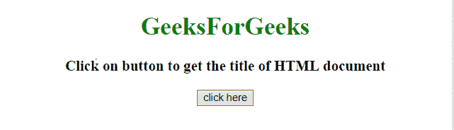
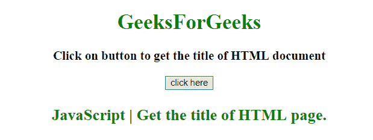

# 如何获取一个 HTML 页面的标题？

> 原文:[https://www . geesforgeks . org/如何获取 html 页面标题/](https://www.geeksforgeeks.org/how-to-get-the-title-of-an-html-page/)

任务是使用 javascript 获取 HTML 文档的标题。有许多方法可以做到这一点，但这里讨论一些最优选的技术。

**示例 1:** 本示例使用 **document.title 属性**获取文档的标题。

```html
<!DOCTYPE HTML>
<html>

<head>
    <title>
        JavaScript 
      | Get the title of HTML page.
    </title>
</head>

<body style="text-align:center;"
      id="body">
    <h1 style="color:green;">  
            GeeksForGeeks  
        </h1>
    <p id="GFG_UP" 
       style="font-size: 19px; 
              font-weight: bold;">
    </p>
    <button onClick="GFG_Fun()">
        click here
    </button>
    <p id="GFG_DOWN" 
       style="color: green;
              font-size: 24px;
              font-weight: bold;">
    </p>
    <script>
        var up = document.getElementById('GFG_UP');
        var down = document.getElementById('GFG_DOWN');
        up.innerHTML =
          'Click on button to get the title of HTML document';

        function GFG_Fun() {
            down.innerHTML = document.title;
        }
    </script>
</body>

</html>
```

**输出:**

*   **点击按钮前:**
    
*   **点击按钮后:**
    

**示例 2:** 本示例通过首先按标签名称选择标题，然后取索引 0 处的元素来获取文档的标题。使用**document . getelementsbytagname()方法**。

```html
<!DOCTYPE HTML>
<html>

<head>
    <title>
        JavaScript | Get the title of HTML page.
    </title>
</head>

<body style="text-align:center;" id="body">
    <h1 style="color:green;">  
            GeeksForGeeks  
        </h1>
    <p id="GFG_UP" style="font-size: 19px; 
              font-weight: bold;">
    </p>
    <button onClick="GFG_Fun()">
        click here
    </button>
    <p id="GFG_DOWN" style="color: green; 
              font-size: 24px;
              font-weight: bold;">
    </p>
    <script>
        var up = document.getElementById('GFG_UP');
        var down = document.getElementById('GFG_DOWN');
        up.innerHTML =
            'Click on button to get the title of HTML document';

        function GFG_Fun() {
            var title = document.getElementsByTagName("title")[0];
            down.innerHTML = title.innerHTML;
        }
    </script>
</body>

</html>
```

**输出:**

*   **点击按钮前:**
    
*   **点击按钮后:**
    