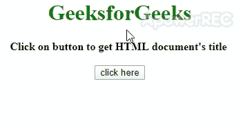

# 如何使用 jQuery 获取当前 HTML 页面的标题？

> 原文:[https://www . geesforgeks . org/如何使用-jquery/](https://www.geeksforgeeks.org/how-to-get-title-of-current-html-page-using-jquery/) 获取当前 html 页面的标题

假设您已经给出了一个 HTML 页面，任务是仅借助 jQuery 获得一个 HTML 页面的标题。下面讨论两种方法:

**方法 1:** 使用 **$('title') jQuery 选择器**选择文档的标题元素，我们可以使用选择器上的 **[text()方法](https://www.geeksforgeeks.org/jquery-text-method/)** 获得文档的标题。

*   **例:**

    ```html
    <!DOCTYPE HTML> 
    <html> 

    <head> 
        <title> 
            Get title of current HTML page
        </title>
        <script src= 
    "https://ajax.googleapis.com/ajax/libs/jquery/3.4.1/jquery.min.js"> 
        </script>
        <style>
            body {
                text-align:center;
            }
            #gfg{
                color: green; 
                font-size: 24px; 
                font-weight: bold;

            }
        </style>
    </head> 

    <body> 
        <h1 style="color:green;"> 
            GeeksforGeeks 
        </h1> 
        <b>
            Click on button to get HTML document's title
        </b> 
        <br><br>
        <button onClick="GFG_Fun()"> click here</button> 
        <p id="gfg"> 
        </p> 

        <script> 
            var down = document.getElementById('gfg'); 

            // Main function
            function GFG_Fun() { 
                down.innerHTML = $('title').text();
            } 
        </script> 
    </body> 
    </html>                    
    ```

*   **输出:** 

**方法二:**使用 **$(文档)jQuery 选择器**选择 HTML 文档，我们可以使用选择器上的 **[attr()方法](https://www.geeksforgeeks.org/jquery-attr-method/)** 通过传递‘title’作为参数来获取文档的标题。

*   **例:**

    ```html
    <!DOCTYPE HTML> 
    <html> 

    <head> 
        <title> 
            Get title of current HTML page
        </title>
        <script src= 
    "https://ajax.googleapis.com/ajax/libs/jquery/3.4.1/jquery.min.js"> 
        </script>
        <style>
            body {
                text-align:center;
            }
            #gfg{
                color: green; 
                font-size: 24px; 
                font-weight: bold;

            }
        </style>
    </head> 

    <body> 
        <h1 style="color:green;"> 
            GeeksforGeeks 
        </h1> 
        <b>
            Click on button to get HTML document's title
        </b> 
        <br><br>
        <button onClick="GFG_Fun()"> click here</button> 
        <p id="gfg"> 
        </p> 

        <script> 
            var down = document.getElementById('gfg'); 

            // Main function
            function GFG_Fun() { 
                down.innerHTML = $(document).attr('title');
            } 
        </script> 
    </body> 
    </html>                    
    ```

*   **输出:** 