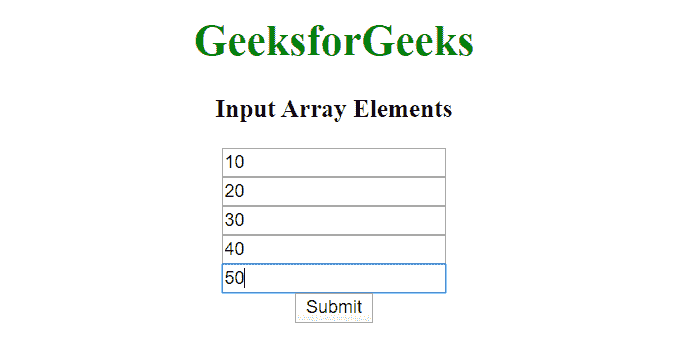

# 如何用 JavaScript 从 html 输入数组中获取值？

> 原文:[https://www . geesforgeks . org/如何使用 javascript 从 html 输入数组中获取值/](https://www.geeksforgeeks.org/how-to-get-values-from-html-input-array-using-javascript/)

这个问题可以通过使用具有相同**“name”**属性值的输入标签来解决，该输入标签可以将存储在一个名称下的多个值分组，该多个值随后可以通过使用该名称来访问。要访问输入字段中输入的所有值，请使用以下方法:

```html
var input = document.getElementsByName('array[]');
```

[**document . GetElementsByname()方法**](https://www.geeksforgeeks.org/html-dom-getelementsbyname-method/) 用于返回存储在特定名称下的所有值，从而使输入变量成为从 0 到输入数量索引的数组。[方法 **document.getElementById()。innerHTML**](https://www.geeksforgeeks.org/html-dom-getelementbyid-method/) 用于更改选中 **Id** 的内部 HTML。因此，通过这种方式，我们可以访问输入值，并将它们转换为数组，并根据您的喜好访问它。我们使用了**表单标签**，因为将表单中的所有输入元素组合在一起通常是一种好的做法，否则在当前的场景中，它是完全可选的。

**示例:**

```html
<!DOCTYPE html>
<html lang="en" dir="ltr">

<head>
    <meta charset="utf-8">
    <title>
        How to get values from html input
        array using JavaScript ?
    </title>
</head>

<body style="text-align: center;">

    <h1 style="color: green;">
        GeeksforGeeks
    </h1>

    <h3 id="po">Input Array Elements</h3>
    <form class="" action="index.html" method="post">
        <input type="text" name="array[]" value="" /><br>
        <input type="text" name="array[]" value="" /><br>
        <input type="text" name="array[]" value="" /><br>
        <input type="text" name="array[]" value="" /><br>
        <input type="text" name="array[]" value="" /><br>
        <button type="button" name="button" onclick="Geeks()">
            Submit
        </button>
    </form>
    <br>

    <p id="par"></p>

    <script type="text/javascript">
        var k = "The respective values are :";
        function Geeks() {
            var input = document.getElementsByName('array[]');

            for (var i = 0; i < input.length; i++) {
                var a = input[i];
                k = k + "array[" + i + "].value= "
                                   + a.value + " ";
            }

            document.getElementById("par").innerHTML = k;
            document.getElementById("po").innerHTML = "Output";
        }
    </script>
</body>

</html>
```

**输出:**

*   **输入数组元素:**
    
*   **输出阵元:**
    

JavaScript 最出名的是网页开发，但它也用于各种非浏览器环境。您可以通过以下 [JavaScript 教程](https://www.geeksforgeeks.org/javascript-tutorial/)和 [JavaScript 示例](https://www.geeksforgeeks.org/javascript-examples/)从头开始学习 JavaScript。

HTML 是网页的基础，通过构建网站和网络应用程序用于网页开发。您可以通过以下 [HTML 教程](https://www.geeksforgeeks.org/html-tutorials/)和 [HTML 示例](https://www.geeksforgeeks.org/html-examples/)从头开始学习 HTML。

CSS 是网页的基础，通过设计网站和网络应用程序用于网页开发。你可以通过以下 [CSS 教程](https://www.geeksforgeeks.org/css-tutorials/)和 [CSS 示例](https://www.geeksforgeeks.org/css-examples/)从头开始学习 CSS。