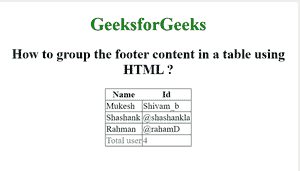

# 如何使用 HTML 以表格的形式对页脚内容进行分组？

> 原文:[https://www . geesforgeks . org/如何分组-页脚-表格形式的内容-使用-html/](https://www.geeksforgeeks.org/how-to-group-footer-content-in-form-of-table-using-html/)

在本文中，我们使用 HTML 中的**<>**标签来定义表格中的页脚内容组。它用于带有标题和正文的 HTML 表格中，称为“标题”和“正文”。< tfoot >标签是表的子标签和< tr >和< td >的父标签。

**语法:**

```html
<tfoot> // Table footer contents... </tfoot>  
```

**示例:**

## 超文本标记语言

```html
<!DOCTYPE html>
<html>

<head>

    <style>
        h1 {
            color: green;
        }

        tfoot {
            color: blue;
        }

        table,
        tbody,
        td {
            border: 1px solid black;
            border-collapse: collapse;
        }
    </style>
</head>

<body>
    <center>
        <h1>GeeksforGeeks</h1>

        <h2>
            How to group the footer content 
            in a table using HTML ?
        </h2>

        <table>
            <thead>
                <tr>
                    <th>Name</th>
                    <th> Id</th>
                </tr>
            </thead>
            <tbody>
                <tr>
                    <td>Mukesh</td>
                    <td>Shivam_b</td>
                </tr>
                <tr>
                    <td>Shashank</td>
                    <td>@shashankla</td>
                </tr>
                <tr>
                    <td>Rahman</td>
                    <td>@rahamD</td>
                </tr>
            </tbody>

            <!-- tfoot tag starts from here -->
            <tfoot>
                <tr>
                    <td>Total user</td>
                    <td>4</td>
                </tr>
            </tfoot>
            <!-- tfoot tag ends here -->

        </table>
    </center>
</body>

</html>
```

**输出**



**支持的浏览器:**

*   谷歌 Chrome
*   微软公司出品的 web 浏览器
*   火狐浏览器
*   歌剧
*   旅行队