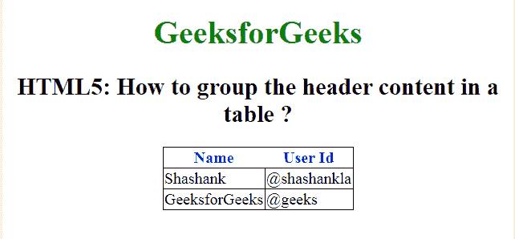

# 如何使用 HTML5 对表格的表头内容进行分组？

> 原文:[https://www . geesforgeks . org/how-to-group-header-content-of-a-table-use-html 5/](https://www.geeksforgeeks.org/how-to-group-header-content-of-a-table-using-html5/)

在本文中，我们定义通过在 HTML 中使用[<>标签](https://www.geeksforgeeks.org/html-th-tag/)来设置表格的标题单元格，从而对表格中的标题内容进行分组。HTML 表格中的两种类型的单元格。

*   **表头单元格:**用于保存表头信息。
*   **标准单元格:**用于保存数据体。

两个标签([<>](https://www.geeksforgeeks.org/html-th-tag/)[<>](https://www.geeksforgeeks.org/html-td-tag/))的工作方式相同，但文字属性不同。在<第>标签中，文本是粗体居中的，在< td >标签中，文本是常规的，默认情况下是左对齐的。

**语法:**

```html
<th> Contents... </th>
```

**示例:**

```html
<!DOCTYPE html>
<html>

<head>
    <title>
        Group the header content 
        in a table using HTML
    </title>

    <style>
        body {
            text-align: center;
        }

        h1 {
            color: green;
        }

        th {
            color: blue;
        }

        table,
        tbody,
        td {
            border: 1px solid black;
            border-collapse: collapse;
        }
    </style>
</head>

<body>
    <center>
        <h1>GeeksforGeeks</h1>

        <h2>
            HTML5: How to group the 
            header content in a table?
        </h2>

        <table>
            <thead>
                <tr>
                    <th>Name</th>
                    <th>User Id</th>
                </tr>
            </thead>
            <tbody>
                <tr>
                    <td>Shashank</td>
                    <td>@shashankla</td>
                </tr>
                <tr>
                    <td>GeeksforGeeks</td>
                    <td>@geeks</td>
                </tr>
            </tbody>
        </table>
    </center>
</body>

</html>                              
```

**输出:**


**支持的浏览器如下:**

*   谷歌 Chrome
*   微软公司出品的 web 浏览器
*   火狐浏览器
*   歌剧
*   旅行队