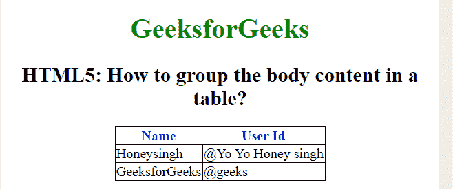

# 如何用 HTML5 对表格中的正文内容进行分组？

> 原文:[https://www . geeksforgeeks . org/如何使用 html5 对表格中的正文内容进行分组/](https://www.geeksforgeeks.org/how-to-group-the-body-content-in-a-table-using-html5/)

在本文中，将正文内容分组到文档中的一个 **<表>** 元素中。它用于定义 HTML 表格中的标准单元格。

**语法:**

```html
<tbody> ... </tbody>
```

**示例:**

```html
<!DOCTYPE html>
<html>

<head>
    <title>
        How to group the body content 
        in a table using HTML5?
    </title>

    <style>
        body {
            text-align: center;
        }

        h1 {
            color: green;
        }

        th {
            color: blue;
        }

        table,
        tbody,
        td {
            border: 1px solid black;
            border-collapse: collapse;
        }
    </style>
</head>

<body>
    <center>
        <h1>GeeksforGeeks</h1>

        <h2>
            HTML5: How to group the body
            content in a table?
        </h2>

        <table>
            <thead>
                <tr>
                    <th>Name</th>
                    <th>User Id</th>
                </tr>
            </thead>
            <tbody>
                <tr>
                    <td>Honeysingh</td>
                    <td>@Yo Yo Honey singh</td>
                </tr>
                <tr>
                    <td>GeeksforGeeks</td>
                    <td>@geeks</td>
                </tr>
            </tbody>
        </table>
    </center>
</body>

</html>
```

**输出:**

**支持的浏览器如下:**

*   谷歌 Chrome
*   微软公司出品的 web 浏览器
*   火狐浏览器
*   歌剧<
*   去旅行