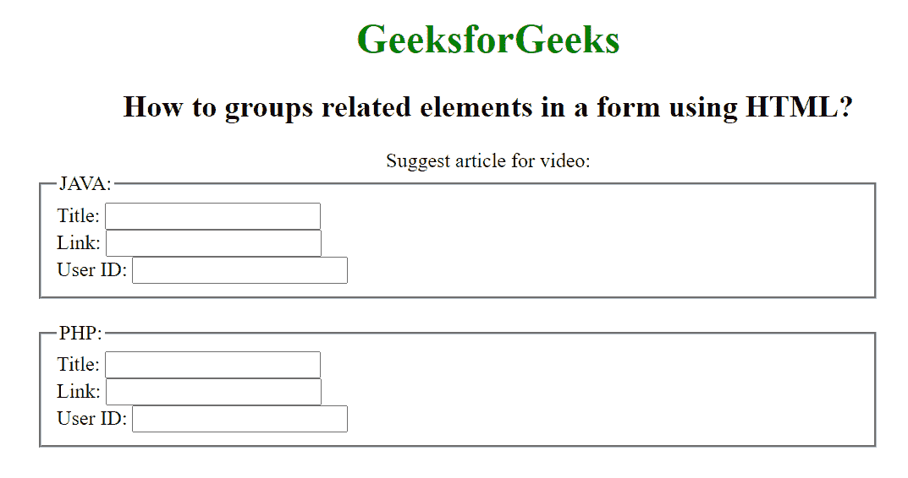

# 如何使用 HTML 对表单中的相关元素进行分组？

> 原文:[https://www . geesforgeks . org/how-to-group-相关-表单元素-使用-html/](https://www.geeksforgeeks.org/how-to-groups-related-elements-in-a-form-using-html/)

HTML5 中的

<fieldset>标签用于在表单中创建一组相关的元素，并在元素上创建框。

<fieldset>标签在 HTML5 中是新的。</fieldset>

</fieldset>

**语法:**

```html
<fieldset> Contents... </fieldset>
```

**属性:**

*   **禁用:**指定禁用相关表单元素组。
*   **表单:**指定字段集所属的一个或多个表单。
*   **名称:**指定字段集的名称。

**示例:**

## 超文本标记语言

```html
<!DOCTYPE html>
<html>

<head>
    <title>
        How to groups related elements
        in a form using HTML?
    </title>

    <style>
        h1,
        h2,
        .title {
            text-align: center;
        }

        fieldset {
            width: 50%;
            margin-left: 22%;
        }

        h1 {
            color: green;
        }
    </style>
</head>

<body>
    <h1>GeeksforGeeks</h1>

    <h2>
        How to groups related elements
        in a form using HTML?
    </h2>

    <form>
        <div class="titl">
            Suggest article for video:
        </div>

        <fieldset>
            <legend>JAVA:</legend>
            Title: <input type="text"><br>
            Link: <input type="text"><br>
            User ID: <input type="text">
        </fieldset>
        <br>
        <fieldset>
            <legend>PHP:</legend>
            Title: <input type="text"><br>
            Link: <input type="text"><br>
            User ID: <input type="text">
        </fieldset>
    </form>
</body>

</html>
```

**输出:**



**支持的浏览器:**

*   谷歌 Chrome
*   微软公司出品的 web 浏览器
*   火狐浏览器
*   旅行队
*   歌剧