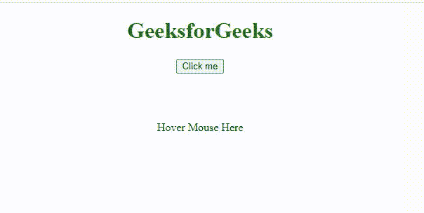

# 如何处理 HTML 中的 JavaScript 事件？

> 原文:[https://www . geesforgeks . org/how-handle-JavaScript-events-in-html/](https://www.geeksforgeeks.org/how-to-handle-javascript-events-in-html/)

事件是软件识别的动作或事件。它可以由用户或系统触发。事件主要用于按钮、超链接、悬停、页面加载等。所有这些东西都在事件处理程序的帮助下开始行动(处理)。

在本文中，您将了解不同类型的 HTML 事件处理程序属性。基本上，要处理 HTML 中的事件，您只需要在 HTML 标记中添加函数，当 HTML 中的任何事件被激发或触发时，该函数将在 JavaScript 中执行。HTML 中有很多事件属性，比如键盘事件、鼠标事件、表单事件等。对其进行了简要讨论。

**语法:**

**用 HTML 处理事件:**

```html
<element onclick="myScript">
```

**各种 HTML 事件属性:**

**表单事件**

*   [**on bulr:**](https://www.geeksforgeeks.org/html-dom-onblur-event/)**当物体失去焦点时会发生此事件。

    ```html
    <element onblur="myScript">
    ```** 
*   **[**onchange:**](https://www.geeksforgeeks.org/html-onchange-event-attribute/) 当元素的值发生更改时，会发生此事件。

    ```html
    <element onchange="myScript">
    ```** 
*   **[**焦点:**](https://www.geeksforgeeks.org/html-dom-onfocus-event/) 当元素获得焦点时，此事件发生。

    ```html
    <element onfocus="myScript">
    ```** 

****示例 1:** 当用户从 [*选择*](https://www.geeksforgeeks.org/html-select-tag/) 标签中选择按钮时，触发 [onchange()](https://www.geeksforgeeks.org/html-onchange-event-attribute/) 事件，然后调用 JavaScript 中存在的 *OnChangeFunction()* 。所以 HTML 中定义的事件处理程序可以调用脚本中定义的函数**

## **超文本标记语言**

```html
<!DOCTYPE html>
<html>

<body>
    <center>
        <h1 style="color: green;">
            GeeksforGeeks
        </h1>

        <input type="text" name="blur" id="blur" 
            onblur="BlurFunction()" 
            placeholder="Enter Name" />
        <br /><br />

        <select id="course" onchange="OnChangeFunction()">
            <option value="Competitive Programming">
                Competitive Programming
            </option>

            <option value="Operating System">
                Operating System
            </option>

            <option value="Web Development">
                Web Development
            </option>

            <option value="Android Development">
                Android Development
            </option>
        </select>

        <p id="demo"></p>
        <br /><br />

        <input type="text" id="focus" 
            onfocus="FocusFunction(this.id)" 
                placeholder="Enter Your Semester" /><br />
    </center>

    <script>
        function BlurFunction() {
            let x = document.getElementById("blur");
            x.value = x.value.toUpperCase();
        }

        function OnChangeFunction() {
            let x = document.getElementById("course").value;
            document.getElementById("demo")
                .innerHTML = "You selected: " + x;
        }

        function FocusFunction(x) {
            document.getElementById(x)
                .style.background = "green";
        }
    </script>
</body>

</html>
```

****输出:****

**

模糊、聚焦和改变** 

****事件****

*   **[**onclick:**](https://www.geeksforgeeks.org/html-dom-onclick-event/) 当用户点击某个元素时，会发生此事件。**

```html
<element onclick="myScript">
```

*   **[**onmouseover:**](https://www.geeksforgeeks.org/html-dom-onmouseover-event/)**当用户将鼠标指针悬停在元素上时，会发生此事件。****

```html
**<element onmouseover="myScript">**
```

******例 2:******

## ****超文本标记语言****

```html
**<!DOCTYPE html>
<html>

<body>
    <center>
        <h1 style="color: green;">
            GeeksforGeeks
        </h1>

        <button onclick="OnClickFunction()">
            Click me
        </button>

        <p id="demo"></p>
        <br /><br />

        <p onmouseover="MouseHover()">
            Hover Mouse Here
        </p>
    </center>

    <script>
        function OnClickFunction() {
            document.getElementById("demo")
                .innerHTML = "GeeksforGeeks";
        }

        function MouseHover() {
            alert("Mouse move over");
        }
    </script>
</body>

</html>**
```

******输出:******

****

鼠标悬停**** 

****在上面的输出中，'**点击我'**按钮点击时会调用*OnClickFunction()***T5】功能。 *OnClickFunction()* 是在单独的<脚本>元素中定义的函数。******

****使用 HTML 事件处理程序属性的缺点:****

*   ****使用 HTML 事件处理程序属性分配事件处理程序被认为是一种不好的做法。****
*   ****事件处理程序代码与 HTML 代码混合在一起，这将使代码更难维护和扩展。****
*   ****计时有问题，就好像元素在 JavaScript 代码之前已经完全加载，用户可以开始与网页上的元素进行交互，这会导致错误。****