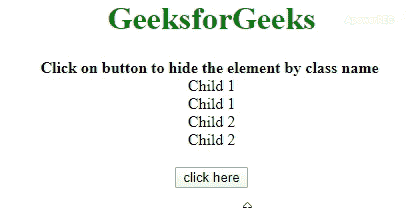

# 如何用 JavaScript 按类隐藏一个 HTML 元素？

> 原文:[https://www . geesforgeks . org/如何使用 javascript 逐类隐藏 html 元素/](https://www.geeksforgeeks.org/how-to-hide-an-html-element-by-class-using-javascript/)

假设您已经给出了一个 HTML 文档，任务是在 JavaScript 的帮助下通过其类名隐藏一个 HTML 元素。有两种方法可以用恰当的例子来解释。

**方法 1:** 在该方法中， **[getElementsByClassName()选择器](https://www.geeksforgeeks.org/html-dom-getelementsbyclassname-method/)** 用于选择特定类的元素。索引用于获取相应索引处的元素。要访问 **[CSS 可见性属性](https://www.geeksforgeeks.org/css-visibility-property/)** ，我们可以在元素上使用**[DOM style . visibility](https://www.geeksforgeeks.org/html-dom-style-visibility-property/)**将其设置为**隐藏**值。

*   **例:**

    ```html
    <!DOCTYPE HTML>
    <html>

    <head>
        <title>
            How to hide an HTML element
            by class in JavaScript
        </title>
        <script src=
    "https://ajax.googleapis.com/ajax/libs/jquery/3.4.1/jquery.min.js">
        </script>
        <style>
            body {
                text-align: center;
            }

            h1 {
                color: green;
            }

            .geeks {
                color: green;
                font-size: 24px;
                font-weight: bold;
            }
        </style>
    </head>

    <body>
        <h1> 
            GeeksforGeeks 
        </h1>
        <b> 
            Click on button to hide the element 
            by class name
        </b>
        <br>
        <div class="outer">
            <div class="child1">Child 1</div>
            <div class="child1">Child 1</div>
            <div class="child2">Child 2</div>
            <div class="child2">Child 2</div>
        </div>
        <br>
        <button onClick="GFG_Fun()">
            click here
        </button>
        <p id="geeks">
        </p>
        <script>
            var down = document.getElementById('GFG_DOWN');

            function GFG_Fun() {
                document.getElementsByClassName('child1')[0].
                style.visibility = 'hidden';
                down.innerHTML = "Element is hidden";
            }
        </script>
    </body>

    </html>
    ```

*   **输出:** 

**方法 2:** 在该方法中， **[querySelectorAll()选择器](https://www.geeksforgeeks.org/html-dom-queryselectorall-method/)** 用于选择特定类的元素。索引用于获取相应索引处的元素。要访问 **[CSS 可见性属性](https://www.geeksforgeeks.org/css-visibility-property/)** ，我们可以在元素上使用**[DOM style . visibility](https://www.geeksforgeeks.org/html-dom-style-visibility-property/)**将其设置为**隐藏**值。

*   **例:**

    ```html
    <!DOCTYPE HTML>
    <html>

    <head>
        <title>
            How to hide an HTML element
            by class in JavaScript
        </title>
        <script src=
    "https://ajax.googleapis.com/ajax/libs/jquery/3.4.1/jquery.min.js">
        </script>
        <style>
            body {
                text-align: center;
            }

            h1 {
                color: green;
            }

            .geeks {
                color: green;
                font-size: 24px;
                font-weight: bold;
            }
        </style>
    </head>

    <body>
        <h1> 
            GeeksforGeeks 
        </h1>
        <b> 
            Click on button to hide the element 
            by class name
        </b>
        <br>
        <div class="outer">
            <div class="child1">Child 1</div>
            <div class="child1">Child 1</div>
            <div class="child2">Child 2</div>
            <div class="child2">Child 2</div>
        </div>
        <br>
        <button onClick="GFG_Fun()">
            click here
        </button>
        <p id="geeks"></p>

        <script>
            var down = document.getElementById('GFG_DOWN');

            function GFG_Fun() {
                document.querySelectorAll('.child1')[0].
                style.visibility = 'hidden';
                down.innerHTML = "Element is hidden";
            }
        </script>
    </body>

    </html>
    ```

*   **输出:** 