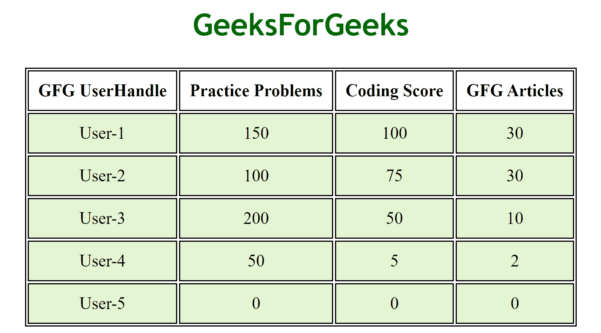
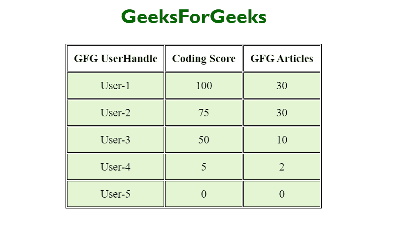

# 如何使用 jQuery 在移动视图中隐藏一个 HTML 元素？

> 原文:[https://www . geesforgeks . org/how-hide-a-html-element-in-mobile-view-use-jquery/](https://www.geeksforgeeks.org/how-to-hide-an-html-element-in-mobile-view-using-jquery/)

假设我们给出了一个 HTML 文档，任务是在 jQuery 的帮助下在移动视图中隐藏一个 HTML 元素。

**进场:**

*   最初，我们需要检测我们的系统是否“移动”，因为使用了*****window . navigator . user agent***属性。它返回一个字符串，该字符串包含关于浏览器的名称、版本和平台的信息。因此，使用这个字符串，我们可以检测我们的系统。**
*   **为了隐藏 HTML 元素 ***隐藏()*** **的方法是使用**。**
*   **在这里，在我们的代码中，我们将在移动视图中隐藏表的一列。在表格的桌面视图中，我们有四个不同的列，其表格标题为 *GFG 用户句柄、练习问题、编码分数*、*和 GFG 文章。***
*   **在移动视图中，我们将通过使用元素的类名来隐藏*练习问题*列。**

****实施代码:****

## **超文本标记语言**

```html
<!DOCTYPE html>
<html lang="en">

<head>
    <meta charset="UTF-8">
    <title>GFG User Details</title>

    <!-- jQuery PLUGIN-->
    <script src="https://code.jquery.com/jquery-3.5.1.js"
        integrity=
"sha256-QWo7LDvxbWT2tbbQ97B53yJnYU3WhH/C8ycbRAkjPDc=" 
        crossorigin="anonymous">
    </script>

    <!-- CSS properties to style the page-->
    <style>
        table {
            margin: 0 auto;
            font-size: large;
            border: 1px solid black;
        }

        h1 {
            text-align: center;
            color: #006600;
            font-size: xx-large;
            font-family: 'Gill Sans', 'Gill Sans MT',
                ' Calibri', 'Trebuchet MS', 'sans-serif';
        }

        td {
            background-color: #E4F5D4;
            border: 1px solid black;
        }

        th,
        td {
            font-weight: bold;
            border: 1px solid black;
            padding: 10px;
            text-align: center;
        }

        td {
            font-weight: lighter;
        }
    </style>
</head>

<body>
    <section>
        <h1>GeeksForGeeks</h1>

        <!-- TABLE CONSTRUCTION-->
        <table id="GFGtable">
            <tr>
                <!-- TABLE HEADING -->
                <th class="gfgusername">GFG UserHandle</th>
                <th class="gfgpp">Practice Problems</th>
                <th class="gfgscores">Coding Score</th>
                <th class="gfgarticles">GFG Articles</th>
            </tr>
            <!-- TABLE DATA -->
            <tr>
                <td class="gfgusername">User-1</td>
                <td class="gfgpp">150</td>
                <td class="gfgscores">100</td>
                <td class="gfgarticles">30</td>
            </tr>
            <tr>
                <td class="gfgusername">User-2</td>
                <td class="gfgpp">100</td>
                <td class="gfgscores">75</td>
                <td class="gfgarticles">30</td>
            </tr>
            <tr>
                <td class="gfgusername">User-3</td>
                <td class="gfgpp">200</td>
                <td class="gfgscores">50</td>
                <td class="gfgarticles">10</td>
            </tr>
            <tr>
                <td class="gfgusername">User-4</td>
                <td class="gfgpp">50</td>
                <td class="gfgscores">5</td>
                <td class="gfgarticles">2</td>
            </tr>
            <tr>
                <td class="gfgusername">User-5</td>
                <td class="gfgpp">0</td>
                <td class="gfgscores">0</td>
                <td class="gfgarticles">0</td>
            </tr>
        </table>
    </section>

    <script>
        // CONDITION TO DETECT SYSTEM
        if (window.navigator.userAgent.indexOf("Mobile") > -1) {
            // HIDING ELEMENTS
            $(".gfgpp").hide();
        }                                          
    </script>
</body>

</html>
```

****输出:****

****桌面视图:****

****

****移动视图:**在移动视图中，练习题栏现在成功了。**

****