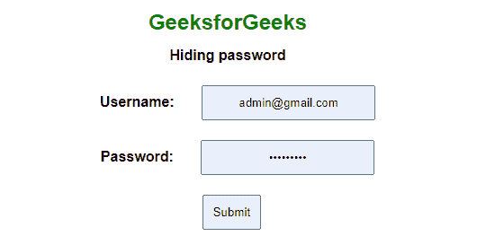
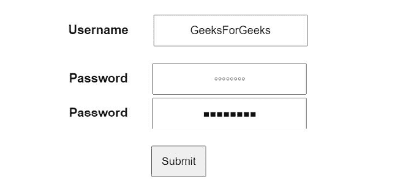

# 如何在 HTML 中隐藏密码？

> 原文:[https://www.geeksforgeeks.org/how-to-hide-password-in-html/](https://www.geeksforgeeks.org/how-to-hide-password-in-html/)

隐藏密码通常称为**密码屏蔽。**当用户使用项目符号(·)、星号(*)或其他字符输入密码时，它会隐藏密码字符。

使用密码屏蔽来确保安全性并避免其被滥用始终是一种良好的做法。通常，当屏幕暴露于投影时，密码屏蔽有助于对任何用户隐藏字符，从而不公开密码。

在本文中，我们将学习使用 HTML 隐藏密码。

**进场:**

**方法 1:** 使用*输入类型=“密码”*

```html
<input type="password" placeholder="Enter your Password">
```

**示例:**

## 超文本标记语言

```html
<!DOCTYPE html>
<html>

<head>
    <style>
        * {
            font-family: Arial;
            margin: 2px;
            padding: 10px;
            text-align: center;
            position: flex;
        }

        h2 {
            color: green;
            padding: 2px;
        }

        body {
            margin-top: 10%;
        }
    </style>
</head>

<body>
    <h2>GeeksforGeeks</h2>

    <b>Hiding password</b>

    <form action="#" method="POST">
        <label> <b>Username:</b> </label>
        <input type="text" 
            placeholder="Enter Username" required />

        <br /><br />
        <label> <b>Password:</b> </label>
        <input type="password" 
            placeholder="Enter Password" required />

        <br /><br />
          <button type="submit">Submit</button>
    </form>
</body>

</html>
```

**输出:**



**方法 2:** 使用*输入类型=“文本”*

*   这种方法不是很受欢迎，在这种方法中，我们只是将文本伪装成我们自己选择的一些字符。
*   这种方法缺乏安全性，建议仅用于其他字符(如正方形、圆形等)的密码屏蔽。
    1.  **为广场:***-网络工具包-文字-安全:广场*

    2.  **为圆圈:***-网络工具包-文字-安全:圆圈*

**示例:**

## 超文本标记语言

```html
<!DOCTYPE html>
<html>

<head>
    <style>
        * {
            font-family: Arial;
            margin: 2px;
            padding: 10px;
            text-align: center;
            position: flex;
        }

        body {
            margin-top: 10%;
        }
    </style>
</head>

<body>
    <form action="#" method="POST">
        <label> <b>Username</b> </label>
        <input type="text" 
            placeholder="Enter Username" required />
        <br /><br />

        <label> <b>Password</b> </label>
        <input type="text" 
            style="-webkit-text-security: circle" 
            placeholder="Enter Password" required />
        <br />

        <label> <b>Password</b> </label>
        <input type="text" 
            style="-webkit-text-security: square" 
            placeholder="Enter Password" required />
        <br /><br />

        <button type="submit">Submit</button>
    </form>
</body>

</html>
```

**输出:**

