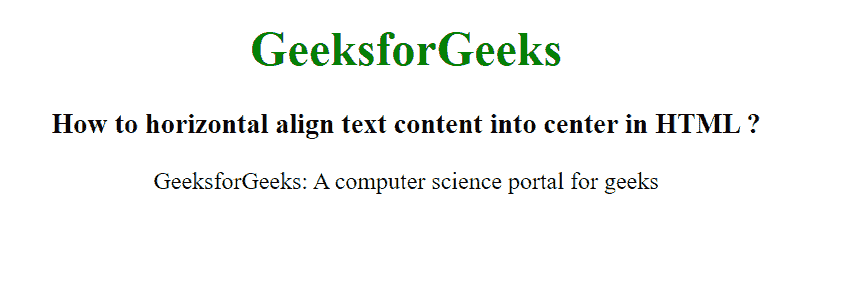

# HTML 中文本内容如何水平对齐居中？

> 原文:[https://www . geeksforgeeks . org/如何在 html 中将文本内容水平对齐到中心位置/](https://www.geeksforgeeks.org/how-to-horizontal-align-text-content-into-center-in-html/)

在本文中，我们将使用 HTML 将文本内容对齐到中心。我们使用 *align="center"* 属性将文本内容设置为居中。

**语法:**

```html
<element_name align="center"> Contents... <element_name>
```

align="center "属性用于将文本内容设置为居中。

**例 1:**

## 超文本标记语言

```html
<!DOCTYPE html>
<html>

<head>
    <title>
        How to horizontal align text
        content into center in HTML?
    </title>

    <style>
        h1 {
            color: green;
        }
    </style>
</head>

<body>
    <h1 align="center">
        GeeksforGeeks
    </h1>

    <h3 align="center">
        How to horizontal align text
        content into center in HTML?
    </h3>

    <p align="center">
        GeeksforGeeks: A computer
        science portal for geeks
    </p>

</body>

</html>
```

**输出:**



**示例 2:** 使用 CSS text-align="center "属性将文本内容设置为居中。

## 超文本标记语言

```html
<!DOCTYPE html>
<html>

<head>
    <title>
        How to horizontal align text
        content into center in HTML?
    </title>

    <style>
        body {
            text-align: center;
        }

        h1 {
            color: green;
        }
    </style>
</head>

<body>
    <h1>GeeksforGeeks</h1>

    <h3>
        How to horizontal align text
        content into center in HTML?
    </h3>

    <p>
        GeeksforGeeks: A computer
        science portal for geeks
    </p>

</body>

</html>
```

**输出:**

