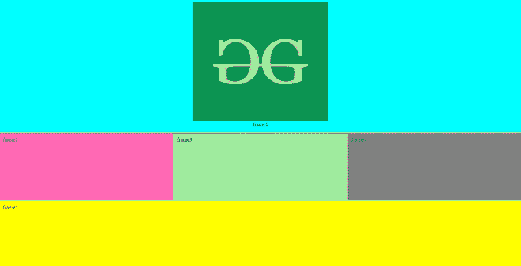

# 如何在 HTML 中将框架集包含在另一个框架集中？

> 原文:[https://www . geesforgeks . org/如何将框架集包含在 html 中的另一个框架集中/](https://www.geeksforgeeks.org/how-to-include-frameset-inside-another-frameset-in-html/)

框架集 [](https://www.geeksforgeeks.org/html-frameset-tag/#:~:text=The%20element%20contains%20one,is%20not%20supported%20in%20HTML5.) 是浏览器窗口中框架的集合。它用于指定框架集中的行数和列数及其空间像素。框架集在现实世界中有一些应用，比如在为任何目的制作网站时，开发人员首先进行整个网站的设计，他将整个网站分成一些框架，使得每个框架都有一些功能。让我们举一个新闻网站的例子，有各种各样的部分，如趋势，最新，商业，板球新闻等，也有一个滑块在一些网站滚动几秒钟后的图像。

在本文中，我们将讨论如何在另一个框架集中创建嵌套框架集或框架集。让我们看一个例子来更好地理解这个话题。为了更好地理解，代码中添加了注释。

### 例子

## 超文本标记语言

```html
<!DOCTYPE html>
<html>

<head>
    <title>Nested Framesets in HTML</title>
</head>

<!-- Frameset tag starts from here -->

<!-- We divide the whole website into three rows -->
<!-- "*" divides equally based on the left space -->
<frameset rows="50%,*,*">

    <!-- Here we are defining the columns 
        in the first row -->
    <!-- It is set to 100% which means that 
        it will cover first row by 100% -->
    <frameset cols="100%">

        <!-- Defining the frame which is 
            to be inserted -->
        <frame name="frame1" src="frame1.html">

    </frameset>

    <!-- Here we are defining the columns 
        in the second row -->
    <frameset cols="*, *, *">
        <frame name="frame2" src="frame2.html">
        <frame name="frame3" src="frame3.html">
        <frame name="frame4" src="frame4.html">
    </frameset>

    <!-- Now the final third row which will 
        cover the rest space -->
    <frame name="frame5" src="frame5.html">

</frameset>
<!-- frameset tag ends here -->

</html>
```

**下面是 frame5.html、frame5.html、frame5.html、frame5.html 的代码，frame5.html:**

## frame1.html

```html
<html>

<head>
    <title>frame1</title>
</head>

<body bgcolor="aqua">
    <center>
        <br>
        frame1
    </center>
</body>

</html>
```

## frame2.html

```html
<html>

<head>
    <title>frame2</title>
</head>

<body bgcolor="hotpink">
    frame2
</body>

</html>
```

## frame3.html

```html
<html>

<head>
    <title>frame3</title>
</head>

<body bgcolor="lightgreen">
    frame3
</body>

</html>
```

## frame4.html

```html
<html>

<head>
    <title>frame4</title>
</head>

<body bgcolor="grey">
    frame4
</body>

</html>
```

## frame5.html

```html
<html>

<head>
    <title>frame5</title>
</head>

<body bgcolor="yellow">
    frame5
</body>

</html>
```

**输出:**

