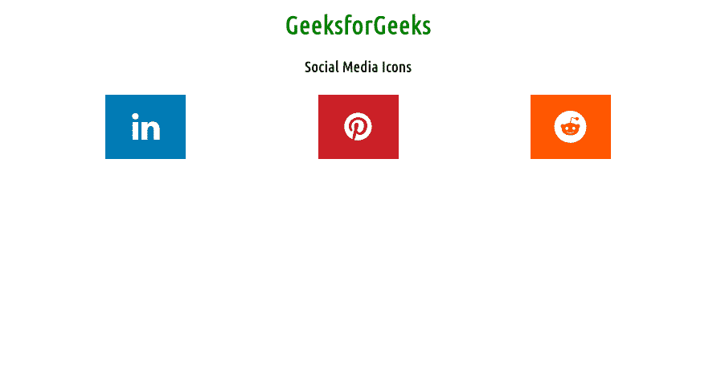

# 如何在 HTML 中包含社交媒体图标？

> 原文:[https://www . geesforgeks . org/how-to-include-social-media-icons-in-html/](https://www.geeksforgeeks.org/how-to-include-social-media-icons-in-html/)

在本文中，我们将看到如何使用 HTML 和 CSS 向任何网站添加社交媒体图标

**进场:**

如果你想附上一个图标，那么你需要一个**字体-真棒 CDN** 链接。社交媒体在推广和宣传你的网站时会非常有帮助。如果你的品牌有社交媒体账户，明智的做法是给网站访问者一个机会加入他们，并在他们的时间表中分享你的帖子。

**注意:**可以添加社交媒体图标为**图片(SVG、PNG )** 或[T5】字体图标](https://www.geeksforgeeks.org/css-icons/) **(字体牛逼)。**在本文中，探索这两种方式。

**方法一:**要使用字体牛逼图标，在<头像>部分添加以下 CDN 链接。

> <link rel="”stylesheet”" href="”https://cdnjs.cloudflare.com/ajax/libs/font-awesome/4.7.0/css/font-awesome.min.css”">

**语法:**

```html
<a href="#" class="fa fa-facebook"></a>
```

**示例 1:** 在本例中，我们使用的是**字体的 awesome 图标(谷歌图标**和**引导图标)**。

## 超文本标记语言

```html
<!DOCTYPE html>
<html>

<head>
    <meta name="viewport" content=
        "width=device-width, initial-scale=1" />
    <link rel="stylesheet" href=
"https://cdnjs.cloudflare.com/ajax/libs/font-awesome/4.7.0/css/font-awesome.min.css" />

    <style>
        .fa:hover {
            opacity: 0.9;
        }

        .fa-linkedin {
            background: #007bb5;
            color: white;
        }

        .fa-pinterest {
            background: #cb2027;
            color: white;
        }

        .fa-reddit {
            background: #ff5700;
            color: white;
        }

        .fa {
            padding: 20px;
            font-size: 40px;
            width: 60px;
            text-decoration: none;
            margin: 5px 80px;
        }

        h1 {
            color: green;
        }
    </style>
</head>

<body>
    <center>
        <h1>GeeksforGeeks</h1>
        <h3>Social Media Icons</h3>

        <!-- Add font awesome icons -->
        <a href="#" class="fa fa-linkedin"></a>
        <a href="#" class="fa fa-pinterest"></a>
        <a href="#" class="fa fa-reddit"></a>
    </center>
</body>

</html>
```

**输出:**



**方法二:**使用谷歌图标，在<头部>部分添加以下链接。

> <link rel="”stylesheet”" href="”https://fonts.googleapis.com/icon?family=Material+Icons”">

**语法:**

```html
<i class="material-icons">facebook</i>
```

**例:**

## 超文本标记语言

```html
<!DOCTYPE>
<html>

<head>
    <link rel="stylesheet" href=
"https://fonts.googleapis.com/icon?family=Material+Icons" />
</head>

<style>
    h1 {
        color: green;
    }

    .material-icons {
        padding: 10px;
        font-size: 40px;
        width: 40px;
        text-decoration: none;
        margin: 5px 80px;
    }

    .android {
        background: #a4c639;
        color: white;
    }

    .facebook {
        background: #3b5998;
        color: white;
    }
</style>

<body>
    <center>
        <h1>GEEKSFORGEEKS</h1>
        <h3>Google Font Icon</h3>
        <i class="material-icons android">android </i>
        <i class="material-icons facebook">facebook</i>
    </center>
</body>

</html>
```

**输出:**


**方法 3:** 在本例中，我们将 **SVG 或 PNG** 图像用于图标。

**语法:**

```html
<svg class="bi bi-google" width="64" height="64" viewBox="0 0 16 16">
   <path d=" "/>
</svg>
```

**注意:**可以通过 **heroicons、bootstrap** icons 等各种网站选择 SVG 图标。引导图标在下面的示例中使用

## 超文本标记语言

```html
<!DOCTYPE html>
<html>
<style>
    h1 {
        color: green;
    }

    .bi-twitter {
        color: #55acee;
        margin: 5px 20px;
    }

    .bi-google {
        color: #dd4b39;
        margin: 5px 20px;
    }

    .bi-youtube {
        color: #dd4b39;
        margin: 5px 20px;
    }
</style>

<body>
    <center>
        <h1>GEEKSFORGEEKS</h1>

        <!----  TWITTER ICON  --->
        <svg xmlns="http://www.w3.org/2000/svg" width="64" 
            height="64" fill="currentColor" class="bi bi-twitter"
            viewBox="0 0 16 16">

            <path d="M5.026 15c6.038 0 9.341-5.003 
            9.341-9.334 0-.14 0-.282-.006-.422A6.685 
            6.685 0 0 0 16 3.542a6.658 6.658 0 0 
            1-1.889.518 3.301 3.301 0 0 0 1.447-1.817
            6.533 6.533 0 0 1-2.087.793A3.286 3.286 0 
            0 0 7.875 6.03a9.325 9.325 0 0 1-6.767-3.429 
            3.289 3.289 0 0 0 1.018 4.382A3.323 3.323 
            0 0 1 .64 6.575v.045a3.288 3.288 0 0 0 
            2.632 3.218 3.203 3.203 0 0 1-.865.115 3.23 
            3.23 0 0 1-.614-.057 3.283 3.283 0 0 0 3.067 
            2.277A6.588 6.588 0 0 1 .78 13.58a6.32 6.32 
            0 0 1-.78-.045A9.344 9.344 0 0 0 5.026 15z" />
        </svg>

        <!----  GOOGLE ICON  --->
        <svg xmlns="http://www.w3.org/2000/svg" width="64" 
            height="64" fill="currentColor" class="bi bi-google"
            viewBox="0 0 16 16">

            <path d="M15.545 6.558a9.42 9.42 0 0 1 .139 
            1.626c0 2.434-.87 4.492-2.384 5.885h.002C11.978 
            15.292 10.158 16 8 16A8 8 0 1 1 8 0a7.689 7.689 
            0 0 1 5.352 2.082l-2.284 2.284A4.347 4.347 0 0 
            0 8 3.166c-2.087 0-3.86 1.408-4.492 3.304a4.792 
            4.792 0 0 0 0 3.063h.003c.635 1.893 2.405 3.301 
            4.492 3.301 1.078 0 2.004-.276 2.722-.764h-.003
            a3.702 3.702 0 0 0 1.599-2.431H8v-3.08h7.545z" />
        </svg>

        <!---- YOUTUBE ICON  --->
        <svg xmlns="http://www.w3.org/2000/svg" width="64" 
            height="64" fill="currentColor" class="bi bi-youtube"
            viewBox="0 0 16 16">

            <path d="M8.051 1.999h.089c.822.003 4.987.033 
            6.11.335a2.01 2.01 0 0 1 1.415 1.42c.101.38.172
            .883.22 1.402l.01.104.022.26.008.104c.065.914.073
            1.77.074 1.957v.075c-.001.194-.01 1.108-.082 
            2.06l-.008.105-.009.104c-.05.572-.124 1.14-.235 
            1.558a2.007 2.007 0 0 1-1.415 1.42c-1.16.312
            -5.569.334-6.18.335h-.142c-.309 0-1.587-.006
            -2.927-.052l-.17-.006-.087-.004-.171-.007-.171
            -.007c-1.11-.049 -2.167-.128-2.654-.26a2.007 
            2.007 0 0 1-1.415-1.419c-.111-.417-.185-.986
            -.235-1.558L.09 9.82l-.008-.104A31.4 31.4 0 0 
            1 0 7.68v-.123c.002-.215.01-.958.064-1.778l
            .007-.103.003-.052.008-.104.022-.26.01-.104c
            .048-.519.119-1.023.22-1.402a2.007 2.007 0 0 
            1 1.415-1.42c.487-.13 1.544-.21 2.654-.26l.17
            -.007.172-.006.086-.003.171-.007A99.788 99.788 
            0 0 1 7.858 2h.193zM6.4 5.209v4.818l4.157
            -2.408L6.4 5.209z" />
        </svg>
    </center>
</body>

</html>
```

**输出:**

