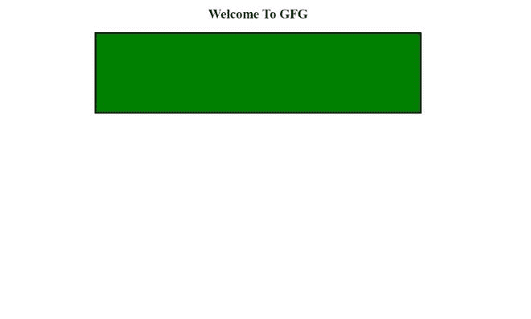

# 如何在 HTML 文件中包含 SVG 代码？

> 原文:[https://www . geesforgeks . org/how-include-SVG-code-inside-html-file/](https://www.geeksforgeeks.org/how-to-include-svg-code-inside-html-file/)

**简介:** SVG 代表**可伸缩矢量图形**。它是用基于 [XML](https://www.geeksforgeeks.org/xml-basics/) 的格式编写的，用于描述矢量图形。在谷歌 Chrome、火狐、Opera 等浏览器中得到广泛支持。并且他们中的许多人倾向于渲染 SVG 图像。设计师也使用 SVG 格式来制作徽标、图标等插图。因为它们在任何分辨率下都是像素完美的。

在本文中，我们将在 [HTML](https://www.geeksforgeeks.org/html-tutorials/) 文件中插入一个示例 SVG 代码，它将帮助您在自己的 HTML 文件中包含任何想要的 SVG 代码。

[**< svg >标记**](https://www.geeksforgeeks.org/svg-tag/) **:** 为了包含 svg 代码，我们不得不在 HTML 代码中使用 **< svg >** 标记。它是一个用于 SVG 图形的容器。写在 HTML 文件的 **<正文>** 部分里面。它有开始和结束标签。我们还在< svg >标签中使用了宽度和高度属性。

现在让我们看一个例子来更好地理解它。

## 超文本标记语言

```html
<!DOCTYPE html>
<html>

<head>
    <title>Include SVG Code</title>
</head>

<body>
    <center>
        <h2>Welcome To GFG</h2>

        <!-- SVG tag starts from here-->
        <svg width="600" height="150">
            <rect width="600" height="150" 
                fill="green" stroke="black" 
                stroke-width="6" />
        </svg>
        <!-- SVG tag ends here-->

    </center>
</body>

</html>
```

**输出:**

