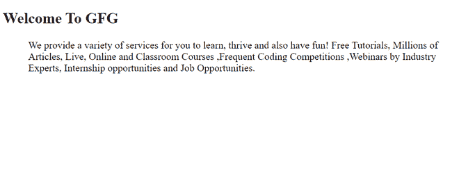

# 如何使用 CSS 缩进 HTML 中的文本？

> 原文:[https://www . geesforgeks . org/如何使用 css 缩进 html 中的文本/](https://www.geeksforgeeks.org/how-to-indent-text-in-html-by-using-css/)

在本文中，我们将讨论在 HTML 文档中缩进文本的各种方法。文本缩进用于设置块中文本行前的空白长度。它通常标志着一个段落的开始。

有两种常见的文本缩进方法:

**方法 1:使用** [**左边距属性** :](https://www.geeksforgeeks.org/css-margin-left-property/) 该属性用于在元素左侧添加边距。它可以通过以适当的长度单位或百分比指定所需的空间来添加所需的缩进。

**示例:**本示例使用左边距属性缩进整个文本块。

## 超文本标记语言

```html
<!DOCTYPE html>
<html>

<head>
    <style>
        p {
            margin-left: 40px;
        }
    </style>
</head>

<body>
    <h2>Welcome To GFG</h2>

    <p>
        We provide a variety of services 
        for you to learn, thrive and also 
        have fun! Free Tutorials, Millions 
        of Articles, Live, Online and 
        Classroom Courses ,Frequent Coding 
        Competitions ,Webinars by Industry 
        Experts, Internship opportunities 
        and Job Opportunities.
    </p>
</body>

</html>
```

**输出:**



**方法 2:使用** [**文本缩进属性:**](https://www.geeksforgeeks.org/css-text-indent-property/) 该属性用于设置段落中第一行文本前的空间量。可以根据需要以长度单位或百分比指定。

**示例:**在本例中，使用 text-缩进属性缩进段落的第一行。

## 超文本标记语言

```html
<!DOCTYPE html>
<html>

<head>
    <style>
        p {
            text-indent: 40px;
        }
    </style>
</head>

<body>
    <h2>Welcome To GFG</h2>

    <p>
        We provide a variety of services 
        for you to learn, thrive and also 
        have fun! Free Tutorials, Millions 
        of Articles, Live, Online and 
        Classroom Courses ,Frequent Coding 
        Competitions ,Webinars by Industry 
        Experts, Internship opportunities 
        and Job Opportunities.
    </p>
</body>

</html>
```

**输出:**

