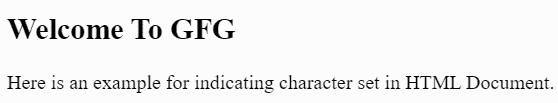

# 如何在 HTML 中表示文档正在使用的字符集？

> 原文:[https://www . geeksforgeeks . org/html 文档使用字符集的指示方式/](https://www.geeksforgeeks.org/how-to-indicate-character-set-being-used-by-a-document-in-html/)

为了让网络浏览器理解 HTML 文档中使用的字符集，已经使用了各种 [HTML 编码](https://www.geeksforgeeks.org/how-to-set-character-encoding-for-document-in-html5/)字符集表示，如 ASCII、ISO-8859-1、UTF-8 等。HTML 文档使用的字符集是使用 HTML 的<头>元素内的<元>标签的字符集属性来表示的。

在 HTML4 中，ISO-8859-1 是默认的字符集。HTML 4 也支持 UTF-8。

```html
<meta http-equiv="Content-Type" content="text/html; charset=UTF-8">
```

在 HTML5 中，开发人员被鼓励使用 UTF-8 字符集，该字符集涵盖了所有字符和符号。因此，UTF-8 是 HTML-5 的默认字符集。

```html
<meta charset="UTF-8">
```

UTF 代表 Unicode 转换格式，其中“8”在 UTF-8 中表示它使用 8 位块来表示一个字符。

**表示字符集的方式:**字符集也缩写为 charset，是 HTML 文档中用来表示字符编码的属性。HTML 文档中的字符集可以通过以下两种方式表示:

**1。使用元标签:**

*   元标签用于指定 HTML 文档中的字符编码。
*   元标签定义了关于不在网页上显示的 HTML 文档的元数据。
*   它有助于搜索引擎了解特定网页的内容。

```html
<head>
    <meta charset="UTF-8">
</head>

```

**2。使用脚本标签:**

*   脚本标签用于指定外部文件中的字符编码。
*   脚本标签定义客户端脚本。
*   脚本标记通过“src”属性引用外部脚本文件。

```html
<script src="script.js" charset="UTF-8"></script>
```

其中字符集是字符编码的属性。字符集允许网络浏览器在将机器代码翻译成人类可读文本时使用字符编码，反之亦然，以在浏览器中显示。

**示例:**在下面的代码部分，提到了这两个标签的示例片段。

## 超文本标记语言

```html
<!DOCTYPE html>
<html>

<head>
    <title>Charset</title>

    <!--using-meta-tag--->
    <meta charset="UTF-8">
</head>

<body>
    <h2>Welcome To GFG</h2>

    <p>
        Here is an example for indicating 
        character set in HTML Document.
    </p>
</body>

</html>
```

**Output:**
