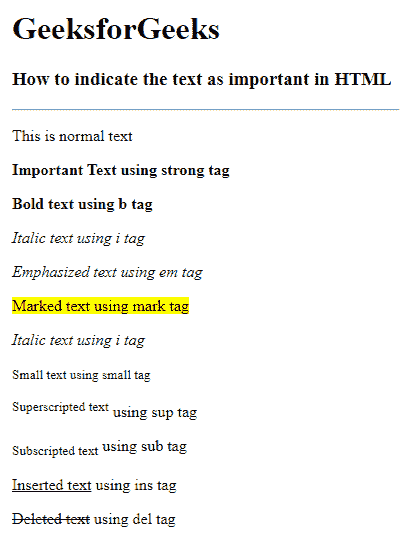

# 在 HTML 中如何表示文字重要？

> 原文:[https://www . geesforgeks . org/如何在 html 中指出文本的重要性/](https://www.geeksforgeeks.org/how-to-indicate-text-is-important-in-html/)

在这篇文章中，我们将知道如何在 HTML 中指出重要的文本或标记为重要的文本。有几个 HTML 元素用于定义具有特殊含义的文本。HTML 中有几个格式元素，其中一些是 **<强>** 、 **< b >** 、 **< i >** 、 **< em >** 、**T28】标记>** 、**T30】小>** 、**T32】sup>**、**T34】子<这些是用于显示文本重要性的解析标签。**

**语法:**

*   [**<strong**](https://www.geeksforgeeks.org/html-strong-tag/)**>:**<strong>标签是解析后的标签，用于显示使文本加粗的文本的重要性。

```html
<strong>Text Content</strong>
```

*   [**<b>**](https://www.geeksforgeeks.org/html-b-tag/)**:**用于指定没有任何额外重要性的粗体文本

```html
<b>Bold Text</b>
```

*   [**< i >**](https://www.geeksforgeeks.org/html-i-tag/) **:用于以斜体显示内容。**

```html
<i>Italic text</i>
```

*   [**<em>**](https://www.geeksforgeeks.org/html-em-tag/)**:**是短语标记，用于强调文本内容。

```html
<em>Emphasized Text</em>
```

*   [**<标记>**](https://www.geeksforgeeks.org/html-mark-tag/#:~:text=HTML%20Tag,-Difficulty%20Level%20%3A%20Basic&text=The%20tag%20in%20HTML,is%20new%20in%20HTML%205.) **:** 用于定义标记的文字。

```html
<mark>Marked Text</mark>
```

*   [**<小>**](https://www.geeksforgeeks.org/html-small-tag/) **:用于设置小字号。**

```html
<small>Smaller Text</small>
```

*   [**< sup** >](https://www.geeksforgeeks.org/html-sup-tag/) :用来形容文字为上标文字。

```html
<sup>Superscripted Text</sup>
```

*   [**<子>**](https://www.geeksforgeeks.org/html-sub-tag/#:~:text=This%20tag%20in%20HTML,the%20formula%20of%20glucose%2Dc6h12o6.) **:** 用于以较小的字体在文字基线以下书写文字。

```html
<sub>Subscripted Text</sub>
```

*   [**<ins>**](https://www.geeksforgeeks.org/html-ins-tag/#:~:text=HTML%20Tag,-Difficulty%20Level%20%3A%20Basic&text=The%20tag%20in%20HTML,using%20CSS%20text%2Ddecoration%20property.)**:**用于指定插入的文本块。

```html
<ins>Inserted Text</ins>
```

*   [**<del>**](https://www.geeksforgeeks.org/html-del-tag/#:~:text=The%20tag%20in%20HTML,using%20CSS%20text%2Ddecoration%20property.)**:**表示删除，用于标记已从文档中删除的部分文本。

```html
<del>Deleted Text</del>
```

我们将利用上面的标签来制作重要的文本&也理解它们在 HTML 中的实现。

**示例:**这个示例说明了如何使用各种 HTML 标签来使文本变得重要。

## 超文本标记语言

```html
<!DOCTYPE html>
<html>

<head>
    <title>Important texts</title>
</head>

<body>
    <h1>GeeksforGeeks</h1>
    <h3>How to indicate the text as important in HTML</h3>
    <hr />
    <!-- normal text-->

<p>This is normal text</p>

    <!-- strong tag-->

<p><strong>Important Text using strong tag</strong></p>

    <!-- bold tag-->

<p><b>Bold text using b tag</b></p>

    <!-- italic tag-->

<p><i>Italic text using i tag</i></p>

    <!-- emphasized tag-->

<p><em>Emphasized text using em tag</em></p>

    <!-- mark tag-->

<p><mark>Marked text using mark tag</mark></p>

    <!-- italic tag-->

<p><i>Italic text using i tag</i></p>

    <!-- small tag-->

<p><small>Small text using small tag</small></p>

    <!-- superscripted tag-->

<p><sup>Superscripted text</sup> using sup tag</p>

    <!-- subscripted tag-->

<p><sub>Subscripted text</sub> using sub tag</p>

    <!-- inserted tag-->

<p><ins>Inserted text</ins> using ins tag</p>

    <!-- deleted tag-->

<p><del>Deleted text</del> using del tag</p>

</body>

</html>
```

**输出:**



**支持的浏览器:**

*   谷歌 Chrome 94.0
*   Firefox 93.0
*   微软边缘 94.0
*   IE 11.0
*   Safari 15.0
*   Opera 80.0