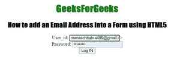

# 如何使用 HTML5 将电子邮件地址插入表单？

> 原文:[https://www . geesforgeks . org/如何使用-html5/](https://www.geeksforgeeks.org/how-to-insert-email-address-into-form-using-html5/) 将电子邮件地址插入表单

在本文中，我们将学习如何通过添加电子邮件输入字段来添加和获取用户的电子邮件地址作为表单的数据。众所周知，email_id 是用户数据的重要组成部分。电子邮件地址用于验证用户。它也用于与提交者直接联系。

**进场:**要完成这个任务，我们要按照以下步骤-

*   创建一个包含<input>标签的 HTML 文档。
*   将类型属性与设置为值“电子邮件”的<input>元素一起使用。

**语法**

```html
<input type="email">
```

**示例 1:** 在本例中，我们正在创建一个包含电子邮件 id(用户名)和密码的表单。

## 超文本标记语言

```html
<!DOCTYPE html>
<html>

<head>
    <title>
        How to add an Email Address
        into a Form using HTML5?
    </title>

    <style>
        #Geek_p {
            font-size: 30px;
            color: green;
        }

        h1,
        h2 {
            font-family: impact;
        }
    </style>
</head>

<body style="text-align: center">
    <h1 style="color: green">GeeksForGeeks</h1>

    <h2>
        How to add an Email Address
        into a Form using HTML5
    </h2>
    <form>
        User_id:
        <input type="email">>
        <br />

        Address:
        <input type="password">
        <br />

        <button>Log IN</button>
    </form>
</body>

</html>
```

**输出:**



**示例 2:** 在本例中，我们正在创建一个电子邮件类型的输入字段。

## 超文本标记语言

```html
<!DOCTYPE html>
<html>

<head>
    <title>
        How to add an Email Address
        into a Form using HTML5?
    </title>

    <style>
        #Geek_p {
            font-size: 30px;
            color: green;
        }

        h1,
        h2 {
            font-family: impact;
        }
    </style>
</head>

<body style="text-align: center">
    <h1 style="color: green">GeeksForGeeks</h1>

    <h2>
        How to add an Email Address
        into a Form using HTML5
    </h2>
    <form>
        Email Address:
        <input type="email">>
        <br />
        <br />

        <button>submit</button>
    </form>
</body>

</html>
```

**输出:**

