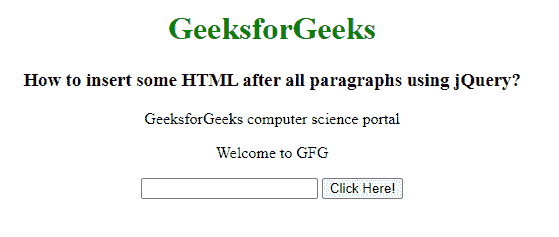

# 如何使用 jQuery 在所有段落后插入一些 HTML？

> 原文:[https://www . geeksforgeeks . org/如何使用-jquery/](https://www.geeksforgeeks.org/how-to-insert-some-html-after-all-paragraphs-using-jquery/) 在所有段落后插入一些 html

在本文中，我们将使用 jQuery 在所有段落之后插入一些 HTML 内容。要在所有段落元素后添加一些内容，我们使用()后的**方法。此方法用于在匹配元素集中的每个选定元素后插入指定的内容。**

**语法:**

```html
$( selector ).after( content );
```

**示例:**

## 超文本标记语言

```html
<html>
<head>
  <!-- Import jQuery from CDN -->
  <script src=
"https://ajax.googleapis.com/ajax/libs/jquery/3.3.1/jquery.min.js">
  </script>

  <script>
    $(document).ready(function () {
      $("button").click(function () {
        $("p").after(
          '<p>Welcome to GFG</p>
          <input type="text">'
        );
      });
    });
  </script>
</head>
<body style="text-align: center;">
  <h1 style="color: green;">
    GeeksforGeeks
  </h1>

  <h3>
    How to insert some HTML after
    all paragraphs using jQuery?
  </h3>

  <p>
    GeeksforGeeks computer 
    science portal
  </p>

  <button>Click Here!</button>
</body>
</html>
```

**输出:**

**点击按钮前:**


**点击按钮后:**

