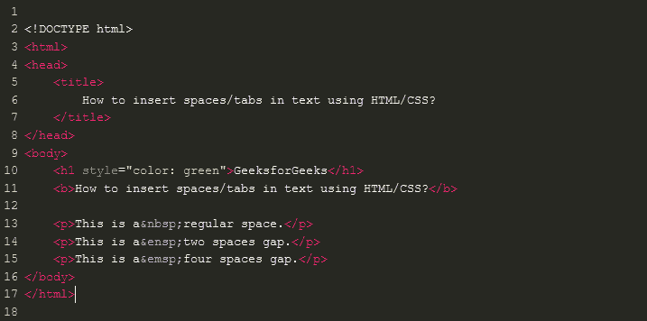
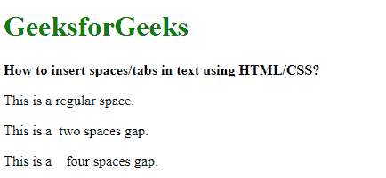
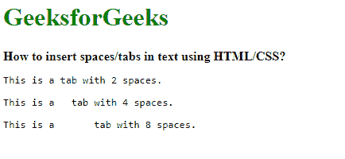
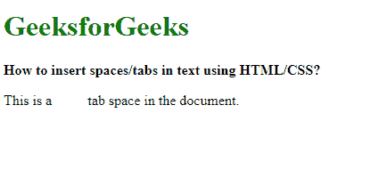

# 如何使用 HTML/CSS 在文本中插入空格/制表符？

> 原文:[https://www . geesforgeks . org/如何使用 html-css 插入空格-文本中的制表符/](https://www.geeksforgeeks.org/how-to-insert-spaces-tabs-in-text-using-html-css/)

可以通过 3 种方法使用 HTML 和 CSS 添加间距:

**方法 1:使用为不同空格指定的特殊字符**

**T2 nbsp；**字符实体，用于表示固定空间中的非中断空间。这可能被认为是正常空间的两倍。它用于在一行中创建一个不能被自动换行打断的空格。

**T2【ensp；**字符实体用于表示“en”空间，表示当前字体的半磅大小。这可能被认为是正常空间的两倍。

**T2【emsp；**字符实体，用于表示“em”空间，表示等于当前字体的磅值。这可能被认为是正常空间的四倍。

**语法:**

```html
Regular space: &nbsp;
Two spaces gap: &ensp;
Four spaces gap: &emsp;

```

**示例:**

```html
<!DOCTYPE html>
<html>
<head>
    <title>
        How to insert spaces/tabs in text using HTML/CSS?
    </title>
</head>
<body>
    <h1 style="color: green">GeeksforGeeks</h1>
    <b>How to insert spaces/tabs in text using HTML/CSS?</b>

    <p>This is a &nbsp; regular space.</p>
    <p>This is a &ensp; two spaces gap.</p>
    <p>This is a &emsp; four spaces gap.</p>
</body>
</html>
```

在上面的代码中，常规空间、两个空间和四个空间的间隙代码是不可见的，所以下面是它的外观


**输出:**


**方法二:使用制表符大小属性设置制表符的间距**

制表符大小 CSS 属性设置每个制表符将显示的空格数。更改此值允许在一个制表符上插入所需的空间。然而，该方法仅适用于预格式化文本(使用

```html
标签)。
```

按住 Alt 键并同时按 0 和 9，可以插入制表符。

**语法:**

```html
.tab {
        tab-size: 2;
    }

```

**示例:**

```html
<!DOCTYPE html>
<html>
<head>
    <title>
        How to insert spaces/tabs in text using HTML/CSS?
    </title>
    <style>
        .tab1 {
            tab-size: 2;
        }

        .tab2 {
            tab-size: 4;
        }

        .tab4 {
            tab-size: 8;
        }
    </style>
</head>
<body>
    <h1 style="color: green">GeeksforGeeks</h1>
    <b>How to insert spaces/tabs in text using HTML/CSS?</b>

    <pre class="tab1">This is a    tab    with 2 spaces.</pre>
    <pre class="tab2">This is a    tab    with 4 spaces.</pre>
    <pre class="tab4">This is a    tab    with 8 spaces.</pre>
</body>
</html>
```

**输出:**


**方法 3:使用 CSS 创建一个新的间距类**

可以创建一个新的类，通过使用左边距属性给出一定的间距。空间量可以由该属性中指定的像素数给出。

display 属性也设置为“inline-block ”,这样就不会在元素后添加换行符。这允许空间位于文本和其他元素旁边。

**语法:**

```html
.tab {
    display: inline-block;
    margin-left: 40px;
}

```

**示例:**

```html
<!DOCTYPE html>
<html>
<head>
    <title>
        How to insert spaces/tabs in text using HTML/CSS?
    </title>
    <style>
        .tab {
            display: inline-block;
            margin-left: 40px;
        }
    </style>
</head>
<body>
    <h1 style="color: green">GeeksforGeeks</h1>
    <b>How to insert spaces/tabs in text using HTML/CSS?</b>

    <p>This is a<span class="tab"></span>tab space in the document.</p>
</body>
</html>
```

**输出:**


HTML 是网页的基础，通过构建网站和网络应用程序用于网页开发。您可以通过以下 [HTML 教程](https://www.geeksforgeeks.org/html-tutorials/)和 [HTML 示例](https://www.geeksforgeeks.org/html-examples/)从头开始学习 HTML。

CSS 是网页的基础，通过设计网站和网络应用程序用于网页开发。你可以通过以下 [CSS 教程](https://www.geeksforgeeks.org/css-tutorials/)和 [CSS 示例](https://www.geeksforgeeks.org/css-examples/)从头开始学习 CSS。