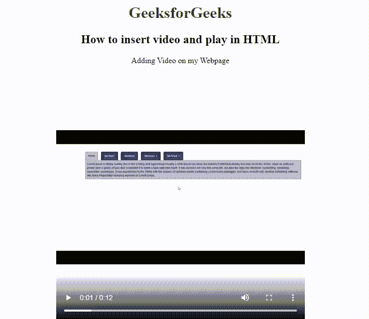

# 如何在网页中插入视频，并使用 HTML 进行播放？

> 原文:[https://www . geesforgeks . org/如何在网页中插入视频并使用 html 进行播放/](https://www.geeksforgeeks.org/how-to-insert-video-in-web-page-and-play-it-using-html/)

HTML 允许使用 [<视频>标签](https://www.geeksforgeeks.org/html5-video/)在网页浏览器中播放视频。为了在网页中嵌入视频，我们使用 *src* 元素来表示文件地址，并使用*宽度*和*高度*属性来定义其大小。

**示例:**在本例中，我们使用<视频>标签向网页中添加视频。视频标签使用宽度、高度和控件属性来设置网页上视频的大小和控件。另外，使用带有 src 属性的源标签来添加视频源。

```html
<!DOCTYPE html> 
<html> 

<body style="text-align: center;"> 

    <h1 style="color: green;">
        GeeksforGeeks
    </h1> 

    <h2> 
        How to insert video 
        and play in HTML
    </h2> 

    <p> 
        Adding Video on my Webpage 
    <p> 

    <video width="500px" height="500px" 
        controls="controls"/> 

        <source src="vid.mp4" 
            type="video/mp4"> 
    </video> 
</body> 

</html> 
```

**输出:**
