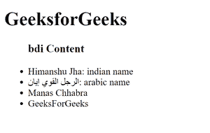

# 如何用 HTML5 隔离一部分可能被格式化为不同方向的文本？

> 原文:[https://www . geesforgeks . org/如何使用-html5/](https://www.geeksforgeeks.org/how-to-isolate-a-part-of-text-that-may-be-formatted-in-a-different-direction-using-html5/) 从不同方向隔离可能被格式化的部分文本

任务是学习如何使用 HTML5 隔离可能以不同方向格式化的文本部分？

**进场:**我们知道 **bdi** 代表双向隔离。基本上。它用于将文本与可能以不同方向格式化的其他文本区分开来。可以使用文档中的[**<【BDI】>标记**](https://www.geeksforgeeks.org/html-5-bdi-tag/) 来完成任务。

**语法:**

```html
<bdi> Contents... </bdi>
```

**示例代码:**以下示例说明了 **bdi 标签**。

## 超文本标记语言

```html
<!DOCTYPE html>
<html>

<body>
    <!--This is heading Tag -->
    <h1>GeeksforGeeks</h1>
    <!--bdi Tag used in unordered list -->
    <ul>
        <h3>bdi Content</h3>
        <li>
            <bdi class="name">Himanshu Jha</bdi>: indian name
        </li>
        <li>
            <bdi class="name">الرجل القوي إيان</bdi>: arabic name
        </li>
        <li><bdi>Manas Chhabra</bdi>
        </li>
        <li><bdi>GeeksForGeeks</bdi></li>
    </ul>
</body>

</html>
```

**输出**



支持的浏览器:谷歌浏览器