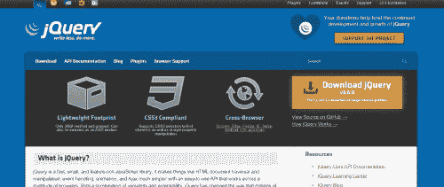
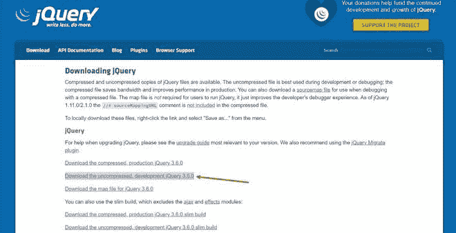
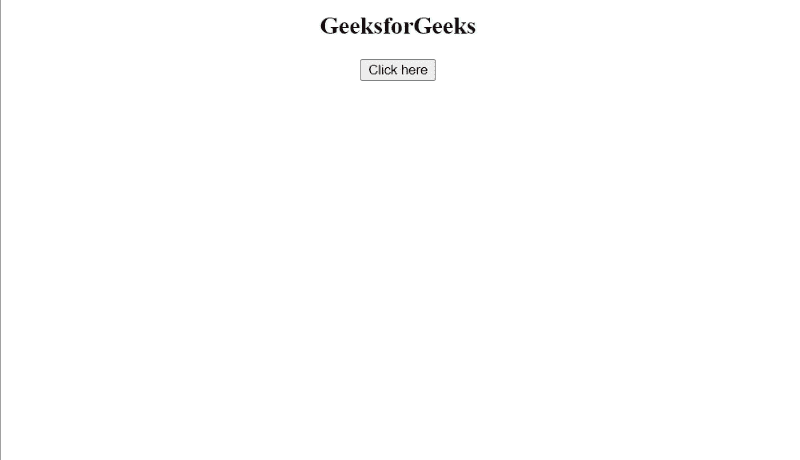

# 如何在 HTML 页面中链接 jQuery？

> 原文:[https://www . geesforgeks . org/how-link-jquery-in-html-page/](https://www.geeksforgeeks.org/how-to-link-jquery-in-html-page/)

[jQuery](https://www.geeksforgeeks.org/jquery-tutorials/) 是目前最常用的 JavaScript 库之一，它比标准 JavaScript 更容易使用，因为它提供了许多内置函数来访问。它是使用 JavaScript 功能构建的，您可以使用所有在 [JavaScript](https://www.geeksforgeeks.org/javascript-tutorial/) 中可用的功能。

在本文中，我们将讨论如何将 jQuery 链接到 [HTML](https://www.geeksforgeeks.org/html-tutorials/) 页面。有两种方法可以将 jQuery 文件包含在 HTML 代码中:

*   通过下载 jQuery 库
*   通过包含来自 CDN 的 jQuery

**下载 jQuery 库:**在这种方法中，我们通过我们系统上的网站直接下载库。基本上，有两个版本可以下载

*   **制作版**–主要用于你的直播网站的压缩版。
*   **开发版本**–这是一个用于开发和测试目的的未压缩版本。

我们将使用开发版本来达到我们的目的。只需按照这些步骤在您的系统上下载 jQuery–

*   打开任意浏览器搜索 jquery.com(是下载 jQuery 库的官方网站)。
*   在主页上，您会在右侧找到下载链接。点击显示的链接。



*   它会带你到下载页面，在那里你会有一些选择。您必须下载未压缩的开发 jQuery，如下所示，并确保将其保存在您的 HTML 文件所在的文件夹中。您必须右键单击该链接，然后从菜单中选择“另存为...”。



现在让我们将其链接到我们的 HTML 代码。只需在 HTML 文件的 **<头>** 部分下添加以下代码:

```html
<script src = "jquery-3.6.0.js" ></script>
```

**注意:**默认情况下，JavaScript 文件按照上面给定的名称保存(这里的版本是 3.6.0)。这些可能会有更新的版本，所以请参考具有该名称的文件。

让我们看一个例子来理解它是如何做到的。下面是相同的 HTML 代码:

## 超文本标记语言

```html
<!DOCTYPE html>
<html>

<head>

    <!-- Linking of jQuery File 
        that we have downloaded -->
    <script src="jquery-3.6.0.js"></script>

    <script>
        $(document).ready(function () {
            $("button").click(function () {
                $("h2").html("Complete Portal for Geeks</b>");
            });
        });
    </script>
</head>

<body>
    <center>
        <h2>GeeksforGeeks</h2>
        <button>Click here</button>
    </center>
</body>

</html>
```

**输出:**



**2。** **包括来自一个 CDN 的 jQuery:**如果你不想使用上面的方法，这里有它的替代解决方案。在这种方法中，您必须通过像谷歌内容分发网络这样的内容分发网络来包含 jQuery。很简单，只需在 HTML 文件的<头>部分下添加以下代码:

现在让我们来看一个例子。下面是 HTML 代码:

## 超文本标记语言

```html
<!DOCTYPE html>
<html>

<head>

    <!--Linking of jQuery file using CDN-->
    <script src=
"https://ajax.googleapis.com/ajax/libs/jquery/3.6.0/jquery.min.js">
    </script>
    <script>
        $(document).ready(function () {
            $("button").click(function () {
                $("h2").html("Complete Portal for Geeks</b>");
            });
        });
    </script>
</head>

<body>
    <center>
        <h2>GeeksforGeeks</h2>
        <button>Click here</button>
    </center>
</body>

</html>
```

**输出:**

