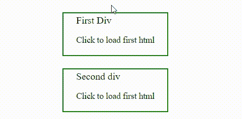

# 如何使用 jQuery 加载外部 HTML 文件？

> 原文:[https://www . geesforgeks . org/how-load-external-html-file-use-jquery/](https://www.geeksforgeeks.org/how-to-load-external-html-file-using-jquery/)

在本文中，我们将学习如何将外部 HTML 文件加载到 [*div*](https://www.geeksforgeeks.org/div-tag-html/) 元素中。

示例代码中使用了以下 jQuery 函数。

*   [**ready():**](https://www.geeksforgeeks.org/jquery-ready-with-examples/)ready 事件发生在**DOM(文档对象模型)已经加载的时候。**

*   **[**load():**](https://www.geeksforgeeks.org/jquery-load-with-examples/)*load()*方法从服务器加载数据，并将返回的数据放入所选元素中。**

****注意:**我们将使用 **ready()** 功能来确保我们的 DOM 在执行任何进一步的任务之前已经完全准备好了。我们将使用**加载()**功能加载外部 HTML。**

****进场:****

*   **首先，我们将创建我们的外部 HTML 文件。**
*   **在我们想要加载外部 HTML 的 HTML 文件上添加一个 [*div*](https://www.geeksforgeeks.org/div-tag-html/) 元素。**
*   **在脚本下，使用 **ready()** 功能检查 DOM 是否就绪。**
*   **然后选择 *div* 元素，我们要使用 **load()在该元素上加载 HTML。****

****外部文件:**以下 div-1.html 和 div-2.html 文件用作外部文件。**

**div-1 . html**

## **超文本标记语言**

```html
<!DOCTYPE html>
<html lang="en">

<head>
    <meta charset="UTF-8">
    <meta http-equiv="X-UA-Compatible" content="IE=edge">
    <meta name="viewport" content=
        "width=device-width, initial-scale=1.0">
    <title>div-1</title>
</head>

<body>
    <p>This content is from first div.</p>
</body>

</html>
```

**div-2 . html**

## **超文本标记语言**

```html
<!DOCTYPE html>
<html lang="en">

<head>
    <meta charset="UTF-8">
    <meta http-equiv="X-UA-Compatible" content="IE=edge">
    <meta name="viewport" content=
        "width=device-width, initial-scale=1.0">
    <title>div 2</title>
</head>

<body>
    <p>This is content from second div</p>
</body>

</html>
```

****HTML 代码:**下面的代码演示了将外部文件加载到一个 HTML i div 中。**

## **超文本标记语言**

```html
<!DOCTYPE html>
<html lang="en">

<head>
    <meta charset="UTF-8">
    <meta http-equiv="X-UA-Compatible" content="IE=edge">
    <meta name="viewport" content=
        "width=device-width, initial-scale=1.0">

    <script src=
"https://ajax.googleapis.com/ajax/libs/jquery/3.2.1/jquery.min.js">
    </script>

    <!-- Some CSS -->
    <style>
        div {
            border: 2px solid green;
            width: fit-content;
            margin: 20px auto;
            padding: 2px 20px;
            cursor: pointer;
        }

        p {
            font-size: 14px;
        }
    </style>
</head>

<body>

    <!-- First div -->
    <div id="div-1">
        First Div
        <p>Click to load first html</p>
    </div>

    <!-- Second div -->
    <div id="div-2">
        Second div
        <p>Click to load first html</p>
    </div>

    <!-- Script -->
    <script>

        // Check if file is completely ready
        $(document).ready(function () {

            // Adding click event on id div-1
            // if it clicked then anonymous
            // function will be called
            $('#div-1').click(function () {

                // Load the exertnal html
                // here this refers to 
                // current selector
                $(this).load('div-1.html');
            });

            // Same as above
            $('#div-2').click(function () {
                $(this).load('div-2.html');
            });
        });
    </script>
</body>

</html>
```

****输出:****

****

****注意:**我们使用的是 jQuery [**点击()**](https://www.geeksforgeeks.org/jquery-click-with-examples/) 功能，也就是说我们点击后会加载外部文件。但是如果您想在 DOM 准备好之后加载外部文件，只需省略 *click()* 事件，并调用 *load()* 函数**