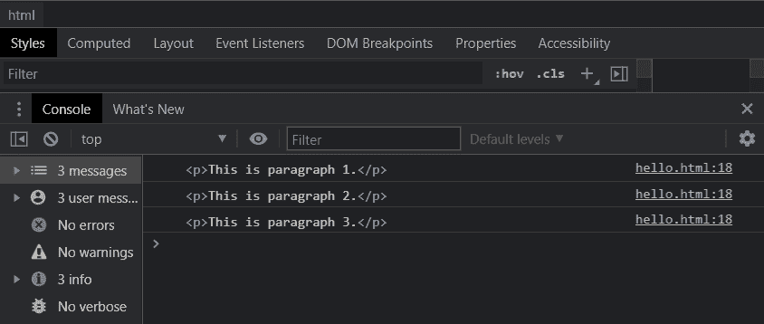

# 如何在 JavaScript 中不使用 forEach()循环的情况下循环遍历 HTML 元素？

> 原文:[https://www . geesforgeks . org/如何在不使用 foreach 循环的情况下循环遍历 html 元素 javascript/](https://www.geeksforgeeks.org/how-to-loop-through-html-elements-without-using-foreach-loop-in-javascript/)

在本文中，我们将学习如何在不使用 forEach()方法的情况下循环遍历 HTML 元素。

**方法 1:** **使用**进行**循环:**HTML 元素可以通过使用**进行**循环的常规 JavaScript 进行迭代。使用*长度*属性可以找到要迭代的元素数量。for 循环有三个部分，初始化、条件表达式和递增/递减表达式。每个项目都可以通过使用带有各自索引的方括号来访问。

**语法:**

```html
for (let i = 0; i < elements.length; i++) {
    console.log(elements[i]);
}

```

**示例:**

## 超文本标记语言

```html
<!DOCTYPE html>
<html>

<body>

    <!-- HTML elements to iterate -->
    <p>This is paragraph 1.</p>
    <p>This is paragraph 2.</p>
    <p>This is paragraph 3.</p>

    <script type="text/javascript">

        // Get the elements to be iterated
        let htmlElements =
            document.getElementsByTagName("p");

        // Use a regular for-loop
        for (let i = 0; i < htmlElements.length; i++) {

            // Print the current element
            console.log(htmlElements[i]);
        }
    </script>
</body>

</html>
```

**输出:**



**方法 2:** **使用 While 循环:**HTML 元素可以通过使用常规的 JavaScript while 循环来迭代。使用*长度*属性可以找到元素的数量。临时值用于通过在条件表达式中检查来跟踪当前迭代。然后可以通过使用带有各自索引的方括号来访问每个项目。

**语法:**

```html
let i = 0;
while(i < elements.length) {
    console.log(elements[i]);
    i++;
}
```

**示例:**

## 超文本标记语言

```html
<!DOCTYPE html>
<html>

<body>

    <!-- HTML elements to iterate -->
    <p>This is paragraph 1.</p>
    <p>This is paragraph 2.</p>
    <p>This is paragraph 3.</p>

    <script type="text/javascript">

        // Get the elements to be iterated
        let htmlElements =
            document.getElementsByTagName("p");

        // Define a variable to keep track
        // of the current iteration
        let i = 0;

        // Check if the current value
        // is lesser than total elements
        while (i < htmlElements.length) {

            // Print the current element
            console.log(htmlElements[i]);

            // Increment the value
            i++;
        }
    </script>
</body>

</html>
```

**输出:**


**方法 3:** **使用“for…..' of '语句:**for…of 语句可用于循环可迭代对象的值。它包括像数组、映射、集合或 HTML 元素这样的对象。一个临时变量保存循环执行期间的当前值，然后可以在循环体中使用。

**语法:**

```html
for (element of elements) {
    console.log(element);
}
```

**示例:**

## 超文本标记语言

```html
<!DOCTYPE html>
<html>

<body>

    <!-- HTML elements to iterate -->
    <p>This is paragraph 1.</p>
    <p>This is paragraph 2.</p>
    <p>This is paragraph 3.</p>

    <script type="text/javascript">

        // Get the elements to be iterated
        let HTMLelements =
            document.getElementsByTagName("p");

        // Use the for...of statement to get
        // the values
        for (elem of HTMLelements) {

            // Print the current element
            console.log(elem);
        }
    </script>
</body>

</html>
```

**输出:**

