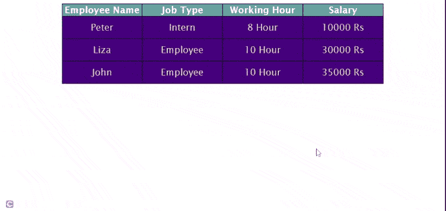

# 如何用 HTML 和 CSS 制作动画表格？

> 原文:[https://www . geeksforgeeks . org/如何使用 html 和 css 制作动画表格/](https://www.geeksforgeeks.org/how-to-make-a-animated-table-using-html-and-css/)

[**表**](https://www.geeksforgeeks.org/html-tables/) 是数据按行和列排列，或者可能是更复杂的结构。表格广泛应用于通信、研究和数据分析。

在本文中，我们将创建一个列上有动画的[表](https://www.geeksforgeeks.org/html-tables/)。我们将使用 **HTML** 和 **CSS** 来实现它。

**进场:** **分步实施:**

**第一步:使用 HTML 创建表格的结构:**我们将使用 HTML 中的表格标签创建表格结构。

## 超文本标记语言

```html
<!DOCTYPE html>
<html lang="en">

<head>
    <meta charset="UTF-8">
    <meta http-equiv="X-UA-Compatible" 
        content="IE=edge">
    <meta name="viewport" content=
        "width=device-width, initial-scale=1.0">

    <!-- Set title of web page -->
    <title>GFG Animated Table</title>
</head>

<body>

    <!-- Creating the structure of table -->
    <table>
        <tr>
            <!-- Creating heading of table -->
            <th>Employee Name</th>
            <th>Job Type</th>
            <th>Working Hour</th>
            <th>Salary</th>
        </tr>

        <tr>
            <!-- Add 1st data to table -->
            <td>Peter</td>
            <td>Intern</td>
            <td>8 Hour</td>
            <td>10000 Rs</td>
        </tr>

        <tr>
            <!-- Add 2nd data to table -->
            <td>Liza</td>
            <td>Employee</td>
            <td>10 Hour</td>
            <td>30000 Rs</td>
        </tr>

        <tr>
            <!-- Add 3rd data to table -->
            <td>John</td>
            <td>Employee</td>
            <td>10 Hour</td>
            <td>35000 Rs</td>
        </tr>
    </table>
</body>

</html>
```

**第二步:使用 CSS 装饰表格:**现在，我们将在之前创建的表格上应用 **CSS** 。

```html
/* Set the content of table using
css properties */
table {
    width: 700px;
    margin: auto;
    text-align: center;
    table-layout: fixed;
}

/* Applying css properties to 
table components */
table,
td,
tr {
    padding: 12px;
    color: wheat;
    background: indigo;
    border: 1px solid black;
    border-collapse: collapse;
    font-size: 20px;
    font-family: 'Lucida Sans', 
        'Lucida Sans Regular', 
        'Lucida Grande',
        'Lucida Sans Unicode', 
        Geneva, Verdana, sans-serif;
}

/* Apply css properties to th */
th {
    color: white;
    border: 1px solid black;
    border-collapse: collapse;
    background: cadetblue;
}

/* Apply hover effect to td */
td:hover {
    background: orangered;
}
```

**完整代码:**给出完整的 HTML 代码作为示例，供大家参考。为了更好地理解，代码中添加了注释。

## 超文本标记语言

```html
<!DOCTYPE html>
<html lang="en">

<head>
    <meta charset="UTF-8">
    <meta http-equiv="X-UA-Compatible" 
            content="IE=edge">
    <meta name="viewport" content=
        "width=device-width, initial-scale=1.0">

    <!-- Set title of web page -->
    <title>GFG Animated Table</title>

    <style>

        /* Set the content of table 
        using css properties */
        table {
            width: 700px;
            margin: auto;
            text-align: center;
            table-layout: fixed;
        }

        /* Applying css properties 
        to table components */
        table,
        td,
        tr {
            padding: 12px;
            color: wheat;
            background: indigo;
            border: 1px solid black;
            border-collapse: collapse;
            font-size: 20px;
            font-family: 'Lucida Sans', 
                'Lucida Sans Regular',
                'Lucida Grande', 
                'Lucida Sans Unicode',
                Geneva, Verdana, sans-serif;
        }

        /* Apply css properties to th */
        th {
            color: white;
            border: 1px solid black;
            border-collapse: collapse;
            background: cadetblue;
        }

        /* Apply hover effect to td */
        td:hover {
            background: orangered;
        }
    </style>
</head>

<body>

    <!-- Creating the structure of table -->
    <table>
        <tr>
            <!-- Creating heading of table -->
            <th>Employee Name</th>
            <th>Job Type</th>
            <th>Working Hour</th>
            <th>Salary</th>
        </tr>

        <tr>
            <!-- Add 1st data to table -->
            <td>Peter</td>
            <td>Intern</td>
            <td>8 Hour</td>
            <td>10000 Rs</td>
        </tr>

        <tr>
            <!-- Add 2nd data to table -->
            <td>Liza</td>
            <td>Employee</td>
            <td>10 Hour</td>
            <td>30000 Rs</td>
        </tr>

        <tr>
            <!-- Add 3rd data to table -->
            <td>John</td>
            <td>Employee</td>
            <td>10 Hour</td>
            <td>35000 Rs</td>
        </tr>
    </table>
</body>

</html>
```

**输出:**



动画桌子