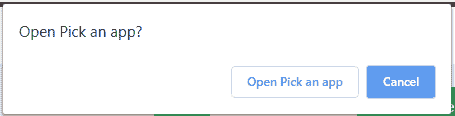

# 如何用 HTML 制作可调用的链接？

> 原文:[https://www . geesforgeks . org/如何使用 html 进行呼叫链接/](https://www.geeksforgeeks.org/how-to-make-a-call-able-link-using-html/)

随着移动网上冲浪的兴起，直接从网页打电话的好处变得更加现实。使用超文本标记语言很容易建立一个可调用的链接。HTML 为浏览器提供了协议，比如电话，用来添加可点击的电话号码。每个浏览器对这些协议的响应都不一样。有些人用显示屏上的号码启动手机应用，等你打电话，而有些人直接打电话。

**进场:**

*   在锚标签的 href 属性中添加电话:(一个号码)。
*   您甚至可以添加国际电话的国家代码作为号码的一部分。
*   有些电话号码有分机。您可以在分机前添加 p，这会在拨打下一部电话前造成一秒钟的延迟。

**语法:**

```html
<a href="tel:(countrycode)(NUMBER)p(extension)"> Text </a>
```

**示例 1:** 本示例使用 HTML 创建一个可调用的链接。

```html
<!DOCTYPE html>
<html>

<head>
    <title>
        How to make a call-able
        link using HTML ?
    </title>

    <style>
        body {
            text-align:center;
        }
        h1 {
            color:green;
        }
    </style>
</head>

<body>
    <h1>GeeksforGeeks</h1>

    <h3>
        Make a call-able link using HTML
    </h3>

    <a href="tel:9876765678">
        Call to GeeksforGeeks support
    </a>
</body>

</html>
```

**输出:**

*   **之前点击链接:**
    
*   **点击链接后:**
    

**示例 2:** 本示例使用 HTML 创建一个可调用的链接。

```
<!DOCTYPE html>
<html>

<head>
    <title>
        How to make a call-able
        link using HTML ?
    </title>

    <style>
        body {
            text-align:center;
        }
        h1 {
            color:green;
        }
        a {
            text-decoration:none;
        }
    </style>
</head>

<body>
    <h1>GeeksforGeeks</h1>

    <h3>
        Make a call-able link using HTML
    </h3>

    <a href="tel:9876765678p107">
        📞 Help
    </a>
</body>

</html>
```

**输出:**

*   **之前点击链接:**
    
*   **点击链接后:**
    