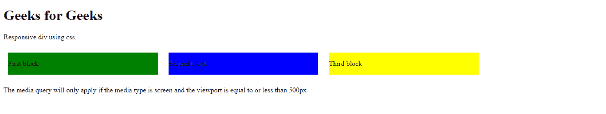
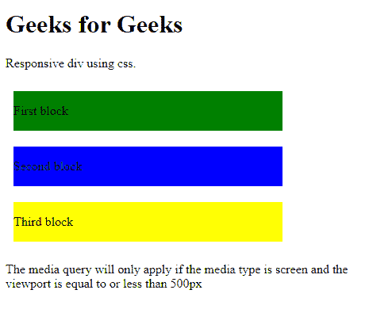

# 如何用 CSS 让一个 HTML div 有响应？

> 原文:[https://www . geesforgeks . org/how-make-a-html-div-responsive-use-CSS/](https://www.geeksforgeeks.org/how-to-make-a-html-div-responsive-using-css/)

CSS *媒体查询*可以用来使一个 HTML“div”有响应。媒体查询允许用户在不改变标记的情况下改变或定制许多设备(如台式机、移动电话、平板电脑等)的网页。使用媒体查询，用户可以针对不同尺寸的屏幕改变特定元素的样式。

CSS *@media* 规则由一种媒体类型组成，它可以有一个或多个表达式，这些表达式可以产生“真”或“假”这样的值。

**语法:**

```html

@media not|only mediatype and (expressions) {
    // Your CSS codes
}

```

以下*元*视口元素必须包含在 HTML 文件的“头”部分中，响应网页才能工作。

**示例:**在以下示例中，所有三个 HTML“div”块都是水平对齐的。但是每当屏幕尺寸减小到“500px”以下时，所有三个块都会自动垂直对齐。 *@media* 屏幕尺寸查询中“div”元素的*宽度*属性设置为小于或等于“500px”。

## 超文本标记语言

```html
<!DOCTYPE html>
<html>

<head>
    <meta name="viewport" content=
        "width=device-width, initial-scale=1.0">
    <style>
        div {
            margin: 10px;
        }

        .first {
            width: 25%;
            display: inline-block;
            background-color: green;
        }

        .second {
            width: 25%;
            display: inline-block;
            background-color: blue;
        }

        .third {
            width: 25%;
            display: inline-block;
            background-color: yellow;
        }

        @media screen and (max-width: 500px) {

            .first,
            .second,
            .third {
                width: 70%;
            }
        }
    </style>
</head>

<body>
    <h1>Geeks for Geeks</h1>
    <p>Responsive div using css.</p>
    <div class="first">
        <p>First block</p>
    </div>
    <div class="second">
        <p>Second block</p>
    </div>
    <div class="third">
        <p>Third block </p>
    </div>
    <p>
        The media query will only apply 
        if the media type is screen
        and the viewport is equal to 
        or less than 500px
    </p>
</body>

</html>
```

**输出:**

*   在原始窗口大小中，所有三个块水平对齐。

    

*   当屏幕尺寸减小到“500px”时，所有三个块都垂直放置。

    

同样，通过在 *@media* 查询部分添加 CSS 代码，可以为不同屏幕大小的特定 HTML 元素添加或更改各种样式，如上例所示。