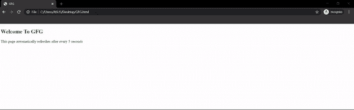

# 如何制作一个强制刷新的 HTML 链接？

> 原文:[https://www . geeksforgeeks . org/如何制作强制刷新的 html 链接/](https://www.geeksforgeeks.org/how-to-make-a-html-link-that-forces-refresh/)

在本文中，我们将学习创建一个强制刷新的 HTML 链接。HTML [< meta > http-equiv 属性](https://www.geeksforgeeks.org/html-meta-http-equiv-attribute/)配合*刷新 *meta 元素*中指定的*值用于刷新网站页面。

刷新指令指定页面自身刷新的时间间隔，其值在*内容属性*中提到为*正整数* r，正整数是页面自身刷新的秒数。

**语法:**

```html
<meta http-equiv="refresh" content="5">
```

## 超文本标记语言

```html
<!DOCTYPE html>
<html>
  <head>
    <meta http-equiv="refresh" content="5" />
  </head>
  <body>
    <h2 style="color: green">
     Welcome To GFG
    </h2>

    <p>
     This page automatically refreshes 
     after every 5 seconds
    </p>
  </body>
</html>
```

**输出:**

