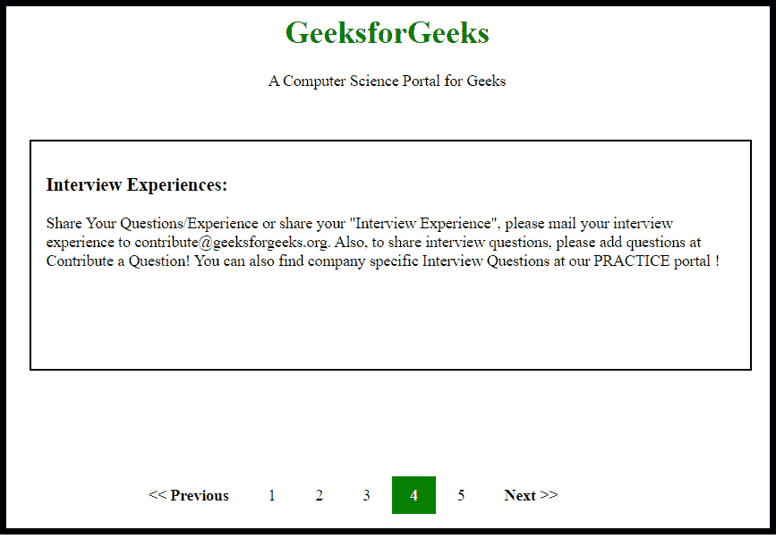

# 如何使用 HTML 和 CSS 进行分页？

> 原文:[https://www . geeksforgeeks . org/如何使用 html 和 css 进行分页/](https://www.geeksforgeeks.org/how-to-make-a-pagination-using-html-and-css/)



为页面创建分页非常简单，您可以通过使用 Bootstrap、JavaScript 和最简单的方式(即 HTML 和 CSS)来实现。当网站在单个页面上包含大量内容时，分页很有帮助，因为单个页面与所有这些主题放在一起看起来不太好。很少有网站使用滚动来避免分页，反之亦然。但是最好的外观来自滚动和分页的结合。作为一个开发人员，你可以在一个页面上放一些内容，让这个页面有一点滚动，直到它变得令人讨厌。之后，您可以使用分页，这将离开以前的内容，进入新的内容页面，但主题将是相同的。

**创建结构:**在本节中，我们将只创建分页的基本网站结构。在这里，我们还将附加标题属性，以便用户可以知道分页的下一页的内容类型。

*   **制作结构的 HTML 代码:**

## 超文本标记语言

```html
<!DOCTYPE html>
<html>

<head>
    <title>
        How to make a Pagination
        using HTML and CSS ?
    </title>
</head>

<body>
    <center>

        <!-- Header and Slogan -->
        <h1>GeeksforGeeks</h1>

<p>A Computer Science Portal for Geeks</p>

    </center>

    <!-- content in this Section -->
    <div class="content">
        <h3>Interview Experiences:</h3>

        <article>
            Share Your Questions/Experience or share
            your "Interview Experience", please mail
            your interview experience to
            review-team@geeksforgeeks.org. Also, to
            share interview questions, please add
            questions at Contribute a Question! You
            can also find company specific Interview
            Questions at our PRACTICE portal !
        </article>
    </div>

    <!-- pagination elements -->
    <div class="pagination_section">
        <a href="#"><< Previous</a>
        <a href="#" title="Algorithm">1</a>
        <a href="#" title="DataStructure">2</a>
        <a href="#" title="Languages">3</a>
        <a href="#" title="Interview" class="active">4</a>
        <a href="#" title="practice">5</a>
        <a href="#">Next >></a>
    </div>
</body>

</html>
```