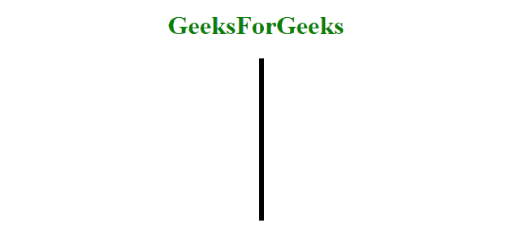
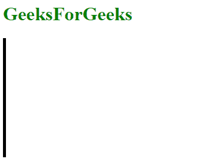

# 如何用 HTML 做垂直线？

> 原文:[https://www . geesforgeks . org/如何使用 html 制作垂直线/](https://www.geeksforgeeks.org/how-to-make-a-vertical-line-using-html/)

若要绘制垂直线，请使用"左边框"或"右边框"属性。height 属性用于设置边框(垂直线)元素的高度。位置属性用于设置垂直线的位置。

**示例 1:** 它使用左边框、高度和位置属性创建一条垂直线。

## 超文本标记语言

```html
<!DOCTYPE html> 
<html> 

<head> 
    <title> 
        HTML border Property
    </title> 

    <!-- style to create vertical line -->
    <style>
        .vertical {
            border-left: 6px solid black;
            height: 200px;
            position:absolute;
            left: 50%;
        }
    </style>
</head>

<body style = "text-align: center;"> 

    <h1 style = "color: green;"> 
        GeeksForGeeks 
    </h1> 

    <div class = "vertical"></div>

</body> 

</html>                                      
```

**输出:**



**示例 2:** 它使用左边框和高度属性创建一条垂直线。

## 超文本标记语言

```html
<!DOCTYPE html> 
<html> 

<head> 
    <title> 
        HTML border Property
    </title> 

    <!-- border-left property is used to
        create vertical line -->
    <style>
        .vertical {
            border-left: 5px solid black;
            height: 200px;
        }
    </style>
</head>

<body> 

    <h1 style= "color: green;"> 
        GeeksForGeeks 
    </h1> 

    <div class= "vertical"></div>

</body> 

</html>                    
```

**输出:**



**支持的浏览器:**

*   谷歌 Chrome
*   微软公司出品的 web 浏览器
*   火狐浏览器
*   歌剧
*   旅行队

HTML 是网页的基础，通过构建网站和网络应用程序用于网页开发。您可以通过以下 [HTML 教程](https://www.geeksforgeeks.org/html-tutorials/)和 [HTML 示例](https://www.geeksforgeeks.org/html-examples/)从头开始学习 HTML。

CSS 是网页的基础，通过设计网站和网络应用程序用于网页开发。你可以通过以下 [CSS 教程](https://www.geeksforgeeks.org/css-tutorials/)和 [CSS 示例](https://www.geeksforgeeks.org/css-examples/)从头开始学习 CSS。