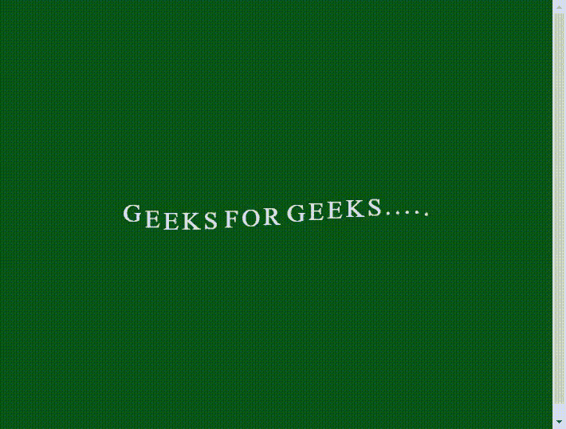

# 如何用 HTML 和 CSS 制作一条垂直的波浪状文本线？

> 原文:[https://www . geesforgeks . org/如何使用 html 和 css 制作垂直波浪文本线/](https://www.geeksforgeeks.org/how-to-make-a-vertical-wavy-text-line-using-html-and-css/)

在本文中，使用 HTML 和 CSS 实现了一个波形动画文本。它是最简单的 CSS 效果之一。对于初学者来说，学习 CSS 伪元素的概念是最好的例子之一。

**方法:**获取波浪文本的基本思路是利用一些 CSS 属性的组合来执行的。主“身体”部分通过使用< span >标签在<身体>标签内创建。CSS 代码用于创建 HTML 结构中“主体”部分的波浪形文本。

**HTML 代码:**下面的代码片段演示了通过在网页中使用 HTML 标签来设计用于波浪效果的文本。

```html
<div class="wavy">
    <span style="--i:1">G</span>
    <span style="--i:2">E</span>
    <span style="--i:3">E</span>
    <span style="--i:4">K</span>
    <span style="--i:5">S</span>
    <span style="--i:6"> </span>
    <span style="--i:7">F</span>
    <span style="--i:8">O</span>
    <span style="--i:9">R</span>
    <span style="--i:10"> </span>
    <span style="--i:11">G</span>
    <span style="--i:12">E</span>
    <span style="--i:13">E</span>
    <span style="--i:14">K</span>
    <span style="--i:15">S</span>
    <span style="--i:16">.</span>
    <span style="--i:17">.</span>
    <span style="--i:18">.</span>
    <span style="--i:19">.</span>
    <span style="--i:20">.</span>
</div>
```

**最终代码:**本示例显示了使用 HTML 和 CSS 制作垂直波浪文本线的完整代码。

## 超文本标记语言

```html
<!DOCTYPE html>
<html>

<head>
    <meta charset="utf-8">
    <style type="text/css">
        body {
            display: flex;
            justify-content: center;
            align-items: center;
            min-height: 100vh;
            background-color: rgb(6, 75, 21);
        }

        .wavy {
            position: relative;
        }

        .wavy span {
            position: relative;
            display: inline-block;
            color: #fff;
            font-size: 2em;
            text-transform: uppercase;
            animation: animate 2s ease-in-out infinite;
            animation-delay: calc(0.1s * var(--i));
        }

        @keyframes animate {
            0% {
                transform: translateY(0px);
            }

            20% {
                transform: translateY(-20px);
            }

            40%,
            100% {
                transform: translateY(0px);
            }
        }
    </style>
</head>

<body>
    <div class="wavy">
        <span style="--i:1">G</span>
        <span style="--i:2">E</span>
        <span style="--i:3">E</span>
        <span style="--i:4">K</span>
        <span style="--i:5">S</span>
        <span style="--i:6"> </span>
        <span style="--i:7">F</span>
        <span style="--i:8">O</span>
        <span style="--i:9">R</span>
        <span style="--i:10"> </span>
        <span style="--i:11">G</span>
        <span style="--i:12">E</span>
        <span style="--i:13">E</span>
        <span style="--i:14">K</span>
        <span style="--i:15">S</span>
        <span style="--i:16">.</span>
        <span style="--i:17">.</span>
        <span style="--i:18">.</span>
        <span style="--i:19">.</span>
        <span style="--i:20">.</span>
    </div>
</body>

</html>
```

**Output:**
