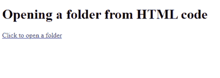
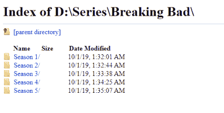
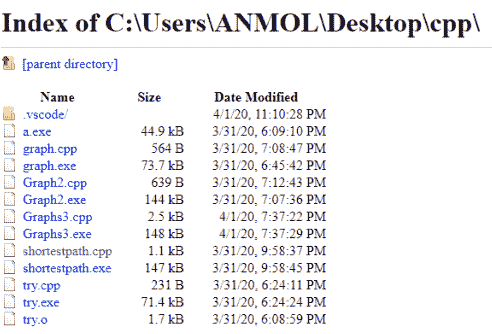

# 如何制作 HTML 链接打开文件夹？

> 原文:[https://www . geesforgeks . org/如何制作一个 html-link-to-open-a-folder/](https://www.geeksforgeeks.org/how-to-make-an-html-link-to-open-a-folder/)

HTML 可以用来打开我们本地存储的文件夹。为了从我们的本地存储打开一个文件夹，使用 HTML 的“HREF”属性。在 HREF 属性中，我们指定文件夹的路径。

**语法:**

```html
<a href="Path"></a>
```

**例 1:**

```html
<!DOCTYPE html>
<html>
<head>
    <title>Sample Code</title>
</head>
 <body>
    <h1>Opening a folder from HTML code</h1>
    <a href="D:\Series\Breaking Bad">Click to open a folder</a>
</body>
</html>
```

**输出:**


**点击链接:**


**例 2:**

```html
<!DOCTYPE html>
<html>
<head>
    <title>Sample Code</title>
</head>
 <body>
    <h1>Opening a folder from HTML code</h1>
    <a href="C:\Users\ABC\Desktop\cpp">
        Click to open a folder
    </a>
</body>
</html>
```

**输出:**


**点击链接:**
