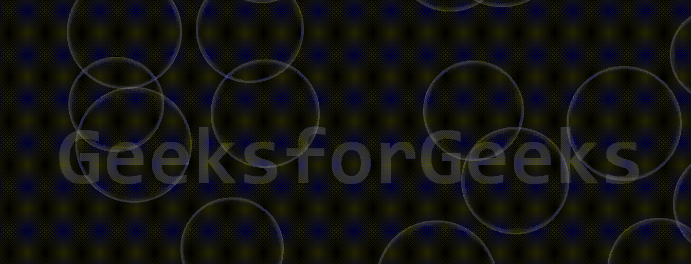

# 如何用 HTML5 和 CSS3 制作泡泡背景？

> 原文:[https://www . geeksforgeeks . org/how-to-bubble-background-use-html 5-and-css3/](https://www.geeksforgeeks.org/how-to-make-bubble-background-using-html5-and-css3/)

利用 HTML、CSS JavaScript 可以轻松生成水泡背景动画。通过使用 HTML5 我们将设计页面的基本主体部分，通过 CSS3 我们将在背景中制作气泡，并且在 JavaScript 的帮助下，它将在整个页面上从下向上移动。
**进场:**

基本思想是使用<lspan>元素创建一个部分，给它一个圆形，然后通过使用 CSS 动画属性 translateY，气泡可以沿着 Y 轴从下向上移动。可以遵循以下步骤来获得期望的结果。使用简单的 HTML 标记创建正文。</lspan>

在正文标签中做一个部分，然后写一些东西显示在页面的正文中。

*   **HTML 代码:**在本节中，我们将设计一个简单的身体结构:

## 超文本标记语言

```html
<!DOCTYPE html>
<html>
    <body>
        <section>
            <h2>GeeksforGeeks</h2>
        </section>
    </body>
</html>
```

*   **CSS 部分:**通过使用 CSS 我们可以在背景中制作气泡。首先，我们用边距、填充和字体样式固定了主体部分。然后我们将尝试固定背景，并使用一些属性，如位置，高度，宽度，背景颜色，文本位置等。然后我们将尝试在背景中制作气泡。由于这是一种悬停效果，所以我们将使用 **span** 和 **span:在**之前固定气泡的位置，然后我们将背景固定为透明的，并给出一些边界，因为它像水气泡一样显示，然后我们必须添加一些动画，如**“动画 4s 线性渐变”**来动画它。CSS 部分的最后一部分，我们将使用**@关键帧动画**沿着 y 轴移动气泡。

## 钢性铸铁

```html
<style>
    * {
        margin: 0;
        padding: 0;
        font-family: consolas;
    }
    section {
        position: relative;
        width: 100%;
        height: 100vh;
        overflow: hidden;
        background: #111;
        display: flex;
        justify-content: center;
        align-items: center;
    }
    section h2 {
        font-size: 10em;
        color: #333;
    }
    section span {
        position: absolute;
        bottom: -50px;
        background: transparent;
        border-radius: 50%;

        pointer-events: none;
        box-shadow: inset 0 0 10px rgba(225, 225, 225, 0.5);
        animation: animate 4s linear infinite;
    }
    sectionspan: before {
        content: "";
        position: absolute;
        width: 100%;
        height: 100%;
        transform: scale(0.25) translate(-70%, -70%);
        background: radial-gradient(#ffffff, transparent);
        border-radius: 50%;
    }
    @keyframes animation {
        0% {
            transform: translateY(0%);
            opacity: 1;
        }
        99% {
            opacity: 1;
        }
        100% {
            transform: translateY(-1200%);
            opacity: ;
        }
    }
</style>
```

*   **JavaScript:**

最后，我们使用 JavaScript 将气泡从页面底部移到顶部。而且会给人一种妩媚和活蹦乱跳的感觉。我们将创建一个名为的函数来创建一个气泡，并编写一些代码。我们会给它动画并设置时间，最后，我们会添加**设置间隔(createBubble，100)** ，因为气泡可以从底部移动到顶部。如果我们不添加这个，气泡会在页面底部产生，但不会移动到顶部，而是继续产生。

*   **JavaScript 代码:**在这里我们将看到如何移动气泡:

## java 描述语言

```html
<script type="text/javascript">
    function createBubble() {
        const section = document.querySelector("Section");
        const createElement = document.createElement("span");
        var size = Math.random() * 60;

        createElement.style.animation = 
          "animation 6s linear infinite";
        createElement.style.width = 180 + size + "px";
        createElement.style.height = 180 + size + "px";
        createElement.style.left = 
          Math.random() * innerWidth + "px";
        section.appendChild(createElement);

        setTimeout(() => {
            createElement.remove();
        }, 4000);
    }
    setInterval(createBubble, 100);
</script>
```

**完整代码:**

## 超文本标记语言

```html
<!DOCTYPE html>
<html lang="en">
    <head>
        <meta charset="UTF-8" />
        <meta name="viewport" 
              content="width=device-width,
                       initial-scale=0.1" />
        <style>
            * {
                margin: 0;
                padding: 0;
                font-family: consolas;
            }
            section {
                position: relative;
                width: 100%;
                height: 100vh;
                overflow: hidden;
                background: #111;
                display: flex;
                justify-content: center;
                align-items: center;
            }
            section h2 {
                font-size: 10em;
                color: #333;
            }
            section span {
                position: absolute;
                bottom: -50px;
                background: transparent;
                border-radius: 50%;

                pointer-events: none;
                box-shadow: inset 0 0 10px 
                  rgba(225, 225, 225, 0.5);
                animation: animate 4s linear infinite;
            }
            sectionspan: before {
                content: "";
                position: absolute;
                width: 100%;
                height: 100%;
                transform: scale(0.25) translate(-70%, -70%);
                background: 
                  radial-gradient(#ffffff, transparent);
                border-radius: 50%;
            }
            @keyframes animation {
                0% {
                    transform: translateY(0%);
                    opacity: 1;
                }
                99% {
                    opacity: 1;
                }
                100% {
                    transform: translateY(-1200%);
                    opacity: ;
                }
            }
        </style>
    </head>
    <body>
        <section>
            <h2>GeeksforGeeks</h2>
        </section>
        <script type="text/javascript">
            function createBubble() {
                const section = 
                      document.querySelector("Section");
                const createElement = 
                      document.createElement("span");
                var size = Math.random() * 60;

                createElement.style.animation = 
                  "animation 6s linear infinite";
                createElement.style.width = 180 + size + "px";
                createElement.style.height = 180 + size + "px";
                createElement.style.left = 
                  Math.random() * innerWidth + "px";
                section.appendChild(createElement);

                setTimeout(() => {
                    createElement.remove();
                }, 4000);
            }
            setInterval(createBubble, 100);
        </script>
    </body>
</html>
```

**输出:**

