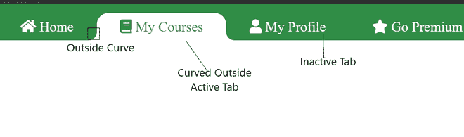
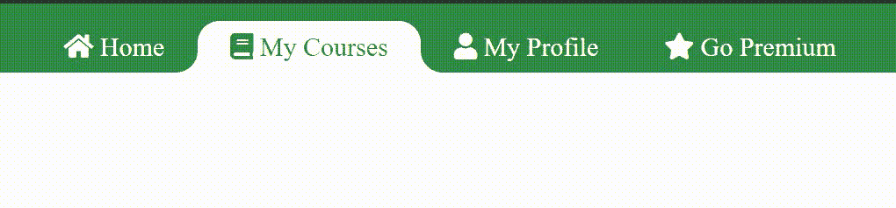
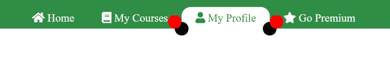
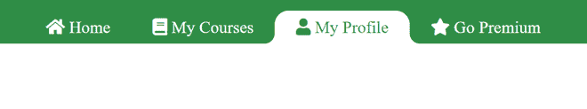
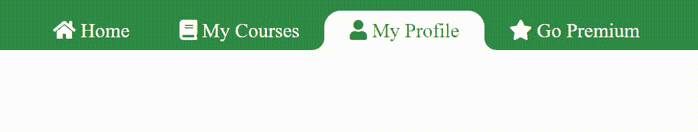

# 如何用 HTML CSS & JavaScript 在导航菜单中制作弯曲的活动标签？

> 原文:[https://www . geesforgeks . org/how-make-curve-active-tab-in-navigation-menu-use-html-CSS-JavaScript/](https://www.geeksforgeeks.org/how-to-make-curved-active-tab-in-navigation-menu-using-html-css-javascript/)

在本文中，我们将了解使用 HTML、CSS 和 Javascript 的导航菜单中使用的活动选项卡的弯曲外部。导航菜单最漂亮的设计之一是“活动选项卡中的曲线外侧”设计。在 CSS 边框半径属性的帮助下，制作内曲线非常容易。但是在制作外部曲线时，它会变得复杂。因此，我们将学习如何使用以下方法在导航菜单中使用 Html CSS 和 JavaScript 制作“活动标签中的弯曲外部”:

*   **方法 1:** 造型两个伪元素。
*   **方法 2:** 使用上面圆的盒形阴影

**外部曲线:**外部曲线是圆角，通过它我们可以将活动元素连接到文档的任何其他元素。让我们看一个例子:



我们将使用以下步骤制作“导航菜单中的活动标签中的弯曲外部”:

**制作带有活动标签的导航菜单:**

现在，在进入“外部曲线”部分之前，我们将使用 HTML 和 CSS 创建一个简单的导航菜单，并在导航菜单中创建一个默认的活动项目，具体步骤如下:

*   创建类导航的 div 元素。
*   在 div 中创建一个无序列表。
*   添加您想要作为无序列表的列表项的图标和链接。
*   为我们的默认活动项目选择一个列表项目。向此项添加活动类。
*   添加自定义 CSS，背景和字体，使我们的导航好看。

**添加 JavaScript–点击**使活动标签可移动

我们已经成功地创建了一个带有活动标签的侧面导航栏。现在我们的任务是激活被点击的链接。在 JavaScript 和 jQuery 的帮助下，我们将按照以下步骤进行:

*   将 jQuery 库添加到我们的 HTML 文档中。
*   向导航菜单的所有列表项添加点击事件。
*   防止默认值以防止恢复到以前的状态。
*   在该函数中，从现有的活动列表项中删除“活动”类。
*   将“active”类添加到单击的列表项中。

**方法一:造型两个伪元素**

*   在列表元素内的
*   在第一个**标签上添加一类“左曲线”，在第二个**标签上添加“底曲线”。****
*   使用类别为“左曲线”的**标记在左侧创建一个矩形。**
*   使用选择器之前的 **css::向该类的元素添加边框半径。**
*   将左曲线显示为**“无”。**
*   当链接处于活动状态时，显示为“阻止”。
*   对“右曲线”(第二个**标记)重复相同的过程。**

**示例:**

## 超文本标记语言

```html
<!DOCTYPE html>
<html lang="en">

<head>
    <title>Curved Outside Active Tab | Geeksforgeeks</title>

    <!--JQuery Library-->
    <script src=
"https://ajax.googleapis.com/ajax/libs/jquery/3.5.1/jquery.min.js">
    </script>

    <!--Font Awesome for the icons-->
    <link rel="stylesheet" href=
"https://cdnjs.cloudflare.com/ajax/libs/font-awesome/5.15.4/css/all.min.css" />

    <!--Style for making the navigation menu-->
    <style>
        .navbar {
            position: fixed;
            left: 0px;
            top: 0px;
            height: auto;
            width: 100%;
            background: #308d46;
        }

        .navbar ul {
            display: flex;
            list-style-type: none;
            margin-block-start: 1em;
            margin-block-end: 1em;
            margin-inline-start: 0px;
            margin-inline-end: 0px;
            padding-inline-start: 0px;
            margin-bottom: 0px;
            padding-left: 40px;
        }

        .navbar ul li {
            display: inline;
            list-style: none;
            padding-left: 30px;
            padding-right: 30px;
            padding-top: 10px;
            padding-bottom: 10px;
            font-size: 1rem;
            border-radius: 20px 20px 0px 0px;
            position: relative;
        }

        .navbar ul li.active {
            background: #fff;
        }

        .navbar ul li a {
            text-decoration: none;
            color: #fff;
        }

        .navbar ul li.active a {
            color: #308d46;
        }
    </style>

    <!-- The Pseudo elements : Style 
      for the outside curve-->
    <style>
        .navbar ul li b.left-curve {
            position: absolute;
            bottom: 0px;
            left: -20px;
            height: 100%;
            width: 20px;
            background: #fff;
            display: none;
        }

        .navbar ul li b.left-curve::before {
            content: "";
            top: 0;
            left: 0;
            position: absolute;
            width: 100%;
            height: 100%;
            border-bottom-right-radius: 20px;
            background: #308d46;
        }

        .navbar ul li b.right-curve {
            position: absolute;
            right: -20px;
            top: 0px;
            height: 100%;
            width: 20px;
            background: #fff;
            display: none;
        }

        .navbar ul li b.right-curve::before {
            content: "";
            right: 0;
            position: absolute;
            width: 100%;
            top: 0;
            height: 100%;
            border-bottom-left-radius: 20px;
            background: #308d46;
        }

        .navbar ul li.active b.left-curve,
        .navbar ul li.active b.right-curve {
            display: block;
        }
    </style>

    <script>
        $(function () {
            $("li").click(function (e) {
                e.preventDefault();
                $("li").removeClass("active");
                $(this).addClass("active");
            });
        });
    </script>
</head>

<body>
    <div class="navbar">
        <ul>
            <li class="list-item">
                <b class="left-curve"></b>
                <b class="right-curve"></b>
                <a>
                    <i class="fa fa-home"></i>
                    Home
                </a>
            </li>
            <li class="list-item">
                <b class="left-curve"></b>
                <b class="right-curve"></b>
                <a>
                    <i class="fa fa-book"></i>
                    My Courses
                </a>
            </li>
            <li class="list-item">
                <b class="left-curve"></b>
                <b class="right-curve"></b>
                <a>
                    <i class="fa fa-user"></i>
                    My Profile
                </a>
            </li>
            <li class="list-item active">
                <b class="left-curve"></b>
                <b class="right-curve"></b>
                <a>
                    <i class="fa fa-star"></i>
                    Go Premium
                </a>
            </li>
        </ul>
    </div>
</body>

</html>
```

**输出:**



**方法二:利用上一个圆的箱形阴影**

*   使用::before 和::after 选择器在活动链接的顶部和底部创建一个圆。
*   用相同的参数创建圆的框形阴影。



*   使圆圈的颜色与导航栏的背景颜色相同，使框阴影的颜色与外部 div 的颜色相同。现在活动链接向外弯曲。



**示例:**

## 超文本标记语言

```html
<!DOCTYPE html>
<html lang="en">

<head>
    <title>Curved Outside Active Tab | Geeksforgeeks</title>

    <!--Font Awesome for the icons-->
    <link rel="stylesheet" href=
"https://cdnjs.cloudflare.com/ajax/libs/font-awesome/5.15.4/css/all.min.css" />

    <!--JQuery Library-->
    <script src=
"https://ajax.googleapis.com/ajax/libs/jquery/3.5.1/jquery.min.js">
    </script>

    <!--Style for making the navigation menu-->
    <style>
        .navbar {
            position: fixed;
            left: 0px;
            top: 0px;
            height: auto;
            width: 100%;
            background: #308d46;
        }

        .navbar ul {
            display: flex;
            list-style-type: none;
            margin-block-start: 1em;
            margin-block-end: 1em;
            margin-inline-start: 0px;
            margin-inline-end: 0px;
            padding-inline-start: 0px;
            margin-bottom: 0px;
            padding-left: 40px;
        }

        .navbar ul li {
            display: inline;
            list-style: none;
            padding-left: 30px;
            padding-right: 30px;
            padding-top: 10px;
            padding-bottom: 10px;
            font-size: 1rem;
            border-radius: 20px 20px 0px 0px;
            position: relative;
        }

        .navbar ul li.active {
            background: #fff;
        }

        .navbar ul li a {
            text-decoration: none;
            color: #fff;
        }

        .navbar ul li.active a {
            color: #308d46;
        }
    </style>

    <!-- The Circles with box-shadow-->
    <style>
        li.active a::before {
            content: "";
            left: -30px;
            bottom: 0;
            height: 30px;
            width: 30px;
            position: absolute;
            background: #308d46;
            border-radius: 50%;
            box-shadow: 15px 15px 0 #fff;
        }

        li.active a::after {
            content: "";
            right: -30px;
            bottom: 0;
            height: 30px;
            width: 30px;
            position: absolute;
            background: #308d46;
            border-radius: 50%;
            box-shadow: -15px 15px 0 #fff;
        }
    </style>

    <script>
        $(function () {
            $("li").click(function (e) {
                e.preventDefault();
                $("li").removeClass("active");
                $(this).addClass("active");
            });
        });
    </script>
</head>

<body>
    <div class="navbar">
        <ul>
            <li class="list-item">
                <a>
                    <i class="fa fa-home"></i>
                    Home
                </a>
            </li>
            <li class="list-item">
                <a>
                    <i class="fa fa-book"></i>
                    My Courses
                </a>
            </li>
            <li class="list-item">
                <a>
                    <i class="fa fa-user"></i>
                    My Profile
                </a>
            </li>
            <li class="list-item active">
                <a>
                    <i class="fa fa-star"></i>
                    Go Premium
                </a>
            </li>
        </ul>
    </div>
</body>

</html>
```

**输出:**

