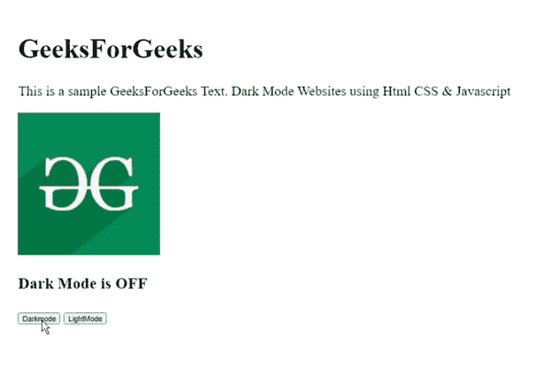
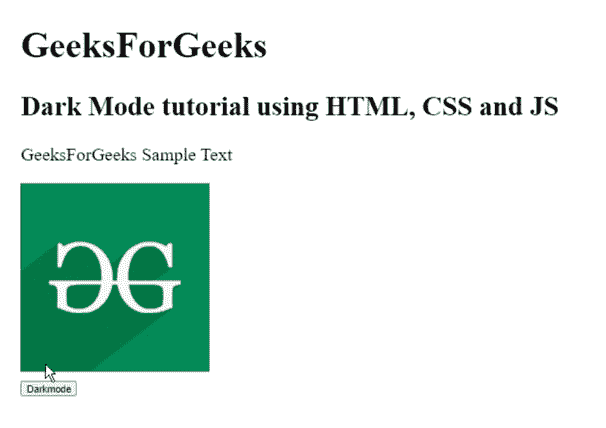

# 如何使用 HTML CSS & JavaScript 为网站制作黑暗模式？

> 原文:[https://www . geesforgeks . org/如何使用 html-css-javascript/](https://www.geeksforgeeks.org/how-to-make-dark-mode-for-websites-using-html-css-javascript/) 为网站制作黑暗模式

亮-暗配色方案，也称为黑色模式、深色模式、深色主题或夜间模式。在这种模式下，浅色文本、图标显示在深色背景上。简而言之，网页的内容显示在黑暗的背景上。暗模式在弱光环境下对眼睛更好。暗模式背后的想法是通过减少设备屏幕发出的光来提高可读性，同时保持最小的色彩对比度。切换到黑暗模式可以让网站用户在任何时候都可以转向一种对眼睛友好且节省资源的设计。

**使用 HTML、CSS 和 JavaScript 创建黑暗模式网站的步骤:**

1.  创建一个 HTML 文档。
2.  将 CSS 属性添加到主体中，并在 CSS 中添加暗模式类属性。
3.  添加按钮在黑暗和光明模式之间切换。
4.  使用 JavaScript 为按钮添加在暗模式和亮模式之间切换的功能。

**示例 1:** 以下示例演示了使用 HTML、CSS 和 JavaScript 代码在亮暗模式之间切换。它使用 2 个函数，即:darkMode()和 lightMode()在两种模式之间切换。

## index.html

```html
<!DOCTYPE html>
<html lang="en">
  <head>
    <meta charset="UTF-8" />
    <meta http-equiv="X-UA-Compatible" content="IE=edge" />
    <meta name="viewport" 
          content="width=device-width, initial-scale=1.0" />
    <title>Document</title>
    <style>
      body {
        padding: 25px;
        background-color: white;
        color: black;
        font-size: 25px;
      }
      .dark-mode {
        background-color: black;
        color: white;
      }
      .light-mode {
        background-color: white;
        color: black;
      }
    </style>
  </head>
  <body>
    <h1>GeeksForGeeks</h1>

    <p>
      This is a sample GeeksForGeeks Text. 
      Dark Mode Websites using Html CSS &
      Javascript
    </p>

    

    <h3 id="DarkModetext">Dark Mode is OFF</h3>
    <button onclick="darkMode()">Darkmode</button>
    <button onclick="lightMode()">LightMode</button>
    <script>
      function darkMode() {
        var element = document.body;
        var content = document.getElementById("DarkModetext");
        element.className = "dark-mode";
        content.innerText = "Dark Mode is ON";
      }
      function lightMode() {
        var element = document.body;
        var content = document.getElementById("DarkModetext");
        element.className = "light-mode";
        content.innerText = "Dark Mode is OFF";
      }
    </script>
  </body>
</html>
```

**输出:**



使用 HTML、CSS 和 Javascript 的暗模式

**示例 2:** 在上面的示例中，我们使用了两个按钮在深色和浅色模式之间切换。现在我们将在 JavaScript 中使用 toggle()方法在暗模式和亮模式之间切换。

## index.html

```html
<!DOCTYPE html>
<html lang="en">
  <head>
    <meta charset="UTF-8" />
    <meta http-equiv="X-UA-Compatible" content="IE=edge" />
    <meta name="viewport" content="width=device-width, initial-scale=1.0" />
    <title>Document</title>
    <style>
      body {
        padding: 25px;
        background-color: white;
        color: black;
        font-size: 25px;
      }
      .dark-mode {
        background-color: black;
        color: white;
      }
    </style>
  </head>
  <body>
    <h1>GeeksForGeeks</h1>
    <h2>Dark Mode tutorial using HTML, CSS and JS</h2>

    <p>GeeksForGeeks Sample Text</p>

    
    <div>
      <button onclick="darkMode()">Darkmode</button>
    </div>
    <script>
      function darkMode() {
        var element = document.body;
        element.classList.toggle("dark-mode");
      }
    </script>
  </body>
</html>
```

**输出:**



使用 HTML、CSS 和 JavaScript 在暗模式和亮模式之间切换