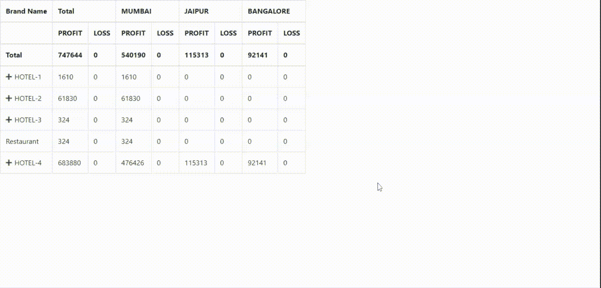

# 如何用 JavaScript 让 HTML 表格点击展开？

> 原文:[https://www . geesforgeks . org/how-make-html-table-expand-on-click-use-JavaScript/](https://www.geeksforgeeks.org/how-to-make-html-table-expand-on-click-using-javascript/)

可扩展的表格可以通过使用带有 HTML 的 JavaScript 来实现。通过点击表格的一行，它会展开并弹出一个子表格。当用户再次点击该行时，内容将被隐藏。当数据复杂但相互关联时，这非常有用。

**示例 1:** 以下示例是使用 HTML、CSS 和 JQuery 实现的。它显示了在一个组织中工作的许多人的年龄、工资和工作的数据。通过单击该行，表格会展开并显示关于该特定员工的描述。

## 超文本标记语言

```html
<!DOCTYPE html>
<html>

<head>
    <script src=
"https://cdnjs.cloudflare.com/ajax/libs/jquery/3.3.1/jquery.min.js">
    </script>
    <script src=
"https://stackpath.bootstrapcdn.com/bootstrap/4.1.2/js/bootstrap.min.js">
    </script>
    <link rel="stylesheet" href=
"https://stackpath.bootstrapcdn.com/bootstrap/4.1.2/css/bootstrap.min.css">
    <link rel="stylesheet" 
        type="text/css" href=
"https://use.fontawesome.com/releases/v5.6.3/css/all.css">

    <script type="text/javascript">
        function showHideRow(row) {
            $("#" + row).toggle();
        }
    </script>

    <style>
        body {
            margin: 0 auto;
            padding: 0px;
            text-align: center;
            width: 100%;
            font-family: "Myriad Pro", 
                "Helvetica Neue", Helvetica, 
                Arial, Sans-Serif;
        }

        #wrapper {
            margin: 0 auto;
            padding: 0px;
            text-align: center;
            width: 995px;
        }

        #wrapper h1 {
            margin-top: 50px;
            font-size: 45px;
            color: #585858;
        }

        #wrapper h1 p {
            font-size: 20px;
        }

        #table_detail {
            width: 500px;
            text-align: left;
            border-collapse: collapse;
            color: #2E2E2E;
            border: #A4A4A4;
        }

        #table_detail tr:hover {
            background-color: #F2F2F2;
        }

        #table_detail .hidden_row {
            display: none;
        }
    </style>
</head>

<body>
    <div id="wrapper">

        <table border=1 id="table_detail" 
            align=center cellpadding=10>

            <tr>
                <th>Name</th>
                <th>Age</th>
                <th>Salary</th>
                <th>Job</th>
            </tr>

            <tr onclick="showHideRow('hidden_row1');">
                <td>Person-1</td>
                <td>24</td>
                <td>60000</td>
                <td>Computer Programmer</td>
            </tr>
            <tr id="hidden_row1" class="hidden_row">
                <td colspan=4>
                    Person-1 is 24 years old and 
                    he is a computer programmer 
                    he earns 60000 per month
                </td>
            </tr>

            <tr onclick="showHideRow('hidden_row2');">
                <td>Person-2</td>
                <td>25</td>
                <td>100000</td>
                <td>Web Designer</td>
            </tr>
            <tr id="hidden_row2" class="hidden_row">
                <td colspan=4>
                    Person-2 is 25 years old and 
                    she is a web designer she earns 
                    100000 per month
                </td>
            </tr>

            <tr onclick="showHideRow('hidden_row3');">
                <td>Person-3</td>
                <td>35</td>
                <td>90000</td>
                <td>Cyber Security Expert</td>
            </tr>
            <tr id="hidden_row3" class="hidden_row">
                <td colspan=4>
                    Person is 35 years old and he 
                    is a cyber security expert he 
                    earns 90000 per month
                </td>
            </tr>

            <tr onclick="showHideRow('hidden_row4');">
                <td>Person-4</td>
                <td>52</td>
                <td>200000</td>
                <td>Content Writer</td>
            </tr>
            <tr id="hidden_row4" class="hidden_row">
                <td colspan=4>
                    Person-4 is 52 years old and he 
                    is a content writer he earns 
                    200000 per month
                </td>
            </tr>

            <tr onclick="showHideRow('hidden_row5');">
                <td>Person-5</td>
                <td>38</td>
                <td>400000</td>
                <td>Chief Executive</td>
            </tr>
            <tr id="hidden_row5" class="hidden_row">
                <td colspan=4>
                    Person-5 is 38 years old and he 
                    is chief executive he earns 
                    400000 per month
                </td>
            </tr>
        </table>
    </div>
</body>

</html>
```

**输出:**


**示例 2:** 下面的示例是使用 HTML、CSS 和 JQuery 实现的。在此表中，显示了多家酒店的损益。通过点击任何一个加号，会显示一个子表，告知酒店在三个不同城市的收入。

## 超文本标记语言

```html
<!DOCTYPE html>
<html>

<head>
    <title>Expandable Table</title>

    <script src=
"https://cdnjs.cloudflare.com/ajax/libs/jquery/3.3.1/jquery.min.js"></script>
    <script src=
"https://stackpath.bootstrapcdn.com/bootstrap/4.1.2/js/bootstrap.min.js"></script>
    <link rel="stylesheet" href=
"https://stackpath.bootstrapcdn.com/bootstrap/4.1.2/css/bootstrap.min.css">
    <link rel="stylesheet" 
        type="text/css" href=
"https://use.fontawesome.com/releases/v5.6.3/css/all.css">
    <div align="center" class=
        "table table-responsive">
        <table id="ExpenseTable" 
            class="table table-responsive 
            table-hover table-bordered">
        </table>
    </div>

    <style>
        .add-btn {
            color: green;
            cursor: pointer;
            margin-right: 6px;
        }
    </style>
</head>

<body>
    <script>
        class CellEntry {
            constructor() {
                this.sum = 0;
                this.percentage = 0;
            }
        }

        class OutletBasedRowEntry {
            constructor() {
                this.cells = {
                    Total: new CellEntry()
                };
                this.childRows = {};
            }
            add(entry) {
                this.cells.Total.sum += entry.netamount;
                this.getOrCreateCellById(
                    entry.outlet).sum += entry.netamount;
            }
            getOrCreateChildRowById(id) {
                if (!this.childRows[id]) 
                    this.childRows[id] = 
                        new OutletBasedRowEntry();
                return this.childRows[id];
            }
            getOrCreateCellById(id) {
                if (!this.cells[id]) 
                    this.cells[id] = new CellEntry();
                return this.cells[id];
            }
        }

        function tabulizeData(data) {
            let TotalRowEntry = new OutletBasedRowEntry();
            data.forEach(entry => {
                TotalRowEntry.add(entry);
                TotalRowEntry.getOrCreateChildRowById(
                        entry.brandname).add(entry);
                TotalRowEntry.getOrCreateChildRowById(
                        entry.brandname).
                        getOrCreateChildRowById(
                        entry.itemname).add(entry);
            });
            renderTable(TotalRowEntry);
        }

        function renderTable(TotalRowEntry) {
            let $table = $('#ExpenseTable');
            let $thead = $(
'<thead><tr><th>Brand Name</th></tr><tr><th></th></tr><tr><th>Total</th></tr><thead>'),
                $tbody = $('<tbody>');
            let $headingRows = $thead.find('tr');

            function addCellEntriesToRow(
                rowEntry, $row) {
                for (let cellName in 
                    TotalRowEntry.cells) {
                    let cellEntry = rowEntry
                        .getOrCreateCellById(cellName);
                    $('<td>').html(cellEntry.sum)
                            .appendTo($row);
                    $('<td>').html(cellEntry.percentage)
                                .appendTo($row);
                }
            }

            $.each(TotalRowEntry.cells, 
                function (cellName, cellEntry) {
                $('<th colspan=2>').html(cellName)
                    .appendTo($headingRows.eq(0));
                $('<th>PROFIT</th>')
                    .appendTo($headingRows.eq(1));
                $('<th>LOSS</th>').appendTo(
                    $headingRows.eq(1));
                $('<th>').html(cellEntry.sum)
                    .appendTo($headingRows.eq(2));
                $('<th>').html(cellEntry.percentage)
                    .appendTo($headingRows.eq(2));
            });

            $.each(TotalRowEntry.childRows, 
                function (brandName, rowEntry) {
                let $row = $('<tr>').appendTo($tbody);
                let rowId = 'row' + $row.index();
                let firstCell = $(
'<td><i class="fas fa-plus add-btn" data-toggle="collapse" data-target=".' 
                    + rowId + '"></i>' + brandName 
                    + '</td>').appendTo($row);
                addCellEntriesToRow(rowEntry, $row);
                $.each(rowEntry.childRows, function (
                        itemName, rowEntry) {
                    $row = $('<tr>').addClass('collapse ' 
                        + rowId).appendTo($tbody);
                    $('<td>').html(itemName).appendTo($row);
                    addCellEntriesToRow(rowEntry, $row);
                });
            });

            $thead.appendTo($table);
            $tbody.appendTo($table);
        }

        tabulizeData([{
            "outlet": "MUMBAI",
            "brandname": "HOTEL-1",
            "itemname": "Restaurant",
            "transactionType": "TransferIn",
            "netamount": 980
        },
        {
            "outlet": "MUMBAI",
            "brandname": "HOTEL-1",
            "itemname": "Hall",
            "transactionType": "TransferIn",
            "netamount": 130
        },
        {
            "outlet": "MUMBAI",
            "brandname": "HOTEL-1",
            "itemname": "Bakery",
            "transactionType": "TransferIn",
            "netamount": 500
        },
        {
            "outlet": "MUMBAI",
            "brandname": "HOTEL-2",
            "itemname": "Restaurant",
            "transactionType": "TransferIn",
            "netamount": 110
        },
        {
            "outlet": "MUMBAI",
            "brandname": "HOTEL-2",
            "itemname": "Party",
            "transactionType": "TransferIn",
            "netamount": 720
        },
        {
            "outlet": "MUMBAI",
            "brandname": "HOTEL-2",
            "itemname": "Pool",
            "transactionType": "TransferIn",
            "netamount": 40000
        },
        {
            "outlet": "MUMBAI",
            "brandname": "HOTEL-2",
            "itemname": "Bakery",
            "transactionType": "TransferIn",
            "netamount": 14000
        },
        {
            "outlet": "MUMBAI",
            "brandname": "HOTEL-2",
            "itemname": "Marriage",
            "transactionType": "TransferIn",
            "netamount": 500
        },
        {
            "outlet": "MUMBAI",
            "brandname": "HOTEL-2",
            "itemname": "Car Valet",
            "transactionType": "TransferIn",
            "netamount": 5500
        },
        {
            "outlet": "MUMBAI",
            "brandname": "HOTEL-2",
            "itemname": "Expense",
            "transactionType": "TransferIn",
            "netamount": 1000
        },
        {
            "outlet": "MUMBAI",
            "brandname": "HOTEL-3",
            "itemname": "Restaurant",
            "transactionType": "TransferIn",
            "netamount": 324
        },
        {
            "outlet": "MUMBAI",
            "brandname": "HOTEL-4",
            "itemname": "Party",
            "transactionType": "LOSS",
            "netamount": 476426
        },
        {
            "outlet": "JAIPUR",
            "brandname": "HOTEL-4",
            "itemname": "Party",
            "transactionType": "LOSS",
            "netamount": 115313
        },
        {
            "outlet": "BANGALORE",
            "brandname": "HOTEL-4",
            "itemname": "Party",
            "transactionType": "LOSS",
            "netamount": 92141
        }
        ]);
    </script>
</body>

</html>
```

**输出:**
