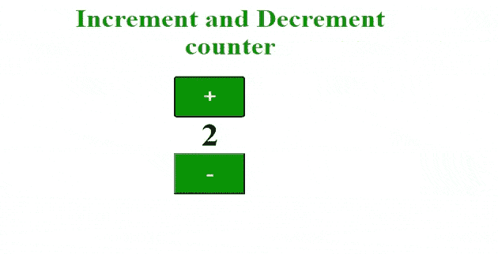

# 如何用 HTML、CSS、JavaScript 制作递增、递减计数器？

> 原文:[https://www . geesforgeks . org/如何使用-html-CSS-和-javascript/](https://www.geeksforgeeks.org/how-to-make-incremental-and-decremental-counter-using-html-css-and-javascript/) 进行递增和递减计数器

在访问不同的购物网站如 **Flipkart** 和**亚马逊**时，您会看到每个产品上都有一个计数器，该计数器用于指定该产品的数量。因此，计数器对许多网站来说是非常有用的部分。在本文中，我们将使用[**HTML**](https://www.geeksforgeeks.org/html-tutorials/)**[**CSS**](https://www.geeksforgeeks.org/css-tutorials/)**和 [**JavaScript**](https://www.geeksforgeeks.org/javascript-tutorial/) 设计一个计数器。****

****提供了一个示例图像，让您对文章有更清晰的了解。****

********

******分步实施:******

******第一步:**首先，我们将使用 [**HTML**](https://www.geeksforgeeks.org/html-tutorials/) 设计一个简单的按钮。请参考代码中的注释。****

## ****index.html****

```html
**<!DOCTYPE HTML> 

<html> 

<head> 
    <meta http-equiv="Content-Type"
        content="text/html; charset=UTF-8" /> 

</head> 

<body> 
  <!-- give a suitable heading using h1 tag-->
        <h1>Increment and Decrement counter</h1>

        <div="container">            
          <!-- adding button and heading to show the digits -->
          <!--increment() and decrement() functions on button click-->
            <button onclick="increment()">+</button>  
            <h2 id="counting"></h2>
            <button onclick="decrement()">-</button>         
        </div>

</body> 

</html> **
```

******第二步:**接下来，我们将使用一些 [**CSS**](https://www.geeksforgeeks.org/css-tutorials/) 属性来设计按钮，并使用*悬停*类来获得鼠标悬停在按钮上时的动画效果。****

## ****style.css****

```html
**/*apply css properties to body tag*/

body {
    position: absolute;
    left: 0%;
    text-align: center;
}

/*apply css properties to container class*/

.container {
    justify-content: center;
    align-items: center;
    display: flex;
    height: 100%;
    text-align: center;
}

/*apply css properties to button tag*/

button {
    width: 90px;
    height: 60px;
    font-size: 30px;
    background-color: green;
    color: honeydew;
}

/*apply hover effect to button tag*/

button:hover {
    background-color: greenyellow;
    color: grey;
}

/*apply css properties to h2 tag*/

h2 {
    color: black;
    margin: 0 50px;
    font-size: 45px;
}

/*apply css properties to h1 tag*/

h1 {
    font-size: 35px;
    color: green;
    text-align: center;
    padding-left: 10%;
}**
```

******第三步:**现在，我们将添加一些 [**JavaScript**](https://www.geeksforgeeks.org/introduction-to-javascript/) 代码，为我们之前创建的按钮添加功能。有关帮助，请参考代码中的注释。****

## ****index.js****

```html
**//initialising a variable name data

var data = 0;

//printing default value of data that is 0 in h2 tag
document.getElementById("counting").innerText = data;

//creation of increment function
function increment() {
    data = data + 1;
    document.getElementById("counting").innerText = data;
}
//creation of decrement function
function decrement() {
    data = data - 1;
    document.getElementById("counting").innerText = data;
}**
```

******完整代码:**在本节中，我们将结合以上三个部分创建一个计数器。****

## ****超文本标记语言****

```html
**<!DOCTYPE html>
<html>
    <head>
        <!-- CSS code-->

        <style>
            /*apply css properties to body tag*/

            body {
                position: absolute;
                left: 0%;
                text-align: center;
            }

            /*apply css properties to container class*/

            .container {
                justify-content: center;
                align-items: center;
                display: flex;
                height: 100%;
                text-align: center;
            }

            /*apply css properties to button tag*/

            button {
                width: 90px;
                height: 60px;
                font-size: 30px;
                background-color: green;
                color: honeydew;
            }

            /*apply hover effect to button tag*/

            button:hover {
                background-color: greenyellow;
                color: grey;
            }

            /*apply css properties to h2 tag*/

            h2 {
                color: black;
                margin: 0 50px;
                font-size: 45px;
            }
            /*apply css properties to h1 tag*/

            h1 {
                font-size: 35px;
                color: green;
                text-align: center;
                padding-left: 10%;
            }
        </style>
    </head>

    <body>
        <!-- give a suitable heading using h1 tag-->
        <h1>Increment and Decrement counter</h1>

        <div ="container">
            <!-- adding button and heading to show the digits -->
            <!-- increment() and decrement() functions on button click-->
            <button onclick="increment()">+</button>
            <h2 id="counting"></h2>
            <button onclick="decrement()">-</button>
        </div>
        <!-- JavaScript code-->
        <script>
            //initialising a variable name data
            var data = 0;

            //printing default value of data that is 0 in h2 tag
            document.getElementById("counting").innerText = data;

            //creation of increment function
            function increment() {
                data = data + 1;
                document.getElementById("counting").innerText = data;
            }
            //creation of decrement function
            function decrement() {
                data = data - 1;
                document.getElementById("counting").innerText = data;
            }
        </script>
    </body>
</html>**
```

 ******Output:**

****