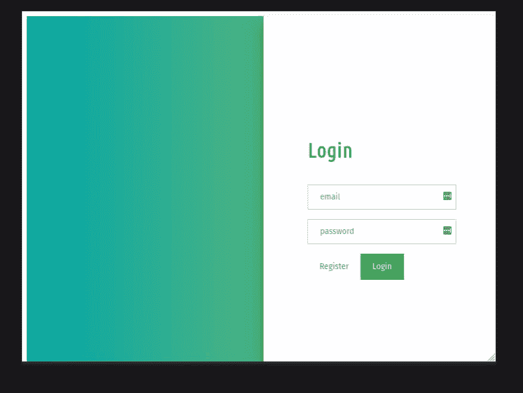

# 如何使用 HTML CSS 和 JavaScript 制作响应性滑动登录和注册表单？

> 原文:[https://www . geesforgeks . org/如何做出响应-滑动-登录-注册-表单-使用-html-CSS-和-javascript/](https://www.geeksforgeeks.org/how-to-make-responsive-sliding-login-and-registration-form-using-html-css-and-javascript/)

表单用于网页中，供用户输入所需的详细信息，然后发送到服务器进行处理。表单也称为网络表单或 HTML 表单。在本文中，您将学习使用 HTML、CSS 和 Javascript 制作一个响应性的滑动登录和注册表单。

本文的主要关键是在点击按钮时将表单滑动到-for(左-右)运动中，这可以使用 jQuery 中的 [**【动画】(**](https://www.geeksforgeeks.org/jquery-animate-with-examples/) )方法来完成，这是 JQuery 中的一个内置方法，用于以 CSS 样式**更改 elemen** t 的状态。

**语法:**

```html
(selector).animate({styles}, para1, para2, para3);
```

本文将进一步讨论在 JQuery 中使用 animate()方法。

**分步实施:**

**HTML 代码:**首先我们添加 HTML 代码，形成**登录登记表的基本结构。**

## 超文本标记语言

```html
<!DOCTYPE html>
<html>

<head>
    <meta name="viewport" content=
        "width=device-width, initial-scale=1" />
    <script src=
"https://ajax.googleapis.com/ajax/libs/jquery/3.3.1/jquery.min.js">
    </script>
</head>

<body>
    <div id="background">
        <div class="background-Right"></div>
        <div class="background-Left"></div>
    </div>

    <div id="slide">
        <div class="top">
            <div class="left">
                <div class="content">
                    <h2>Sign Up</h2>
                    <form method="post"
                        onsubmit="return false;">
                        <div>
                            <input type="text"
                                placeholder="email" />

                            <br />
                            <input type="password"
                                placeholder="password" />
                        </div>
                    </form>

                    <button id="LeftToRight"
                        class="on-off">Login
                    </button>

                    <button>Register</button>
                </div>
            </div>

            <div class="right">
                <div class="content">
                    <h2>Login</h2>
                    <form method="post"
                        onsubmit="return false;">
                        <div>
                            <input type="text"
                                placeholder="email" />

                            <br />
                            <input type="password"
                                placeholder="password" />
                        </div>

                        <button id="RightToLeft"
                            class="on-off">Register
                        </button>

                        <button>Login</button>
                    </form>
                </div>
            </div>
        </div>
    </div>
</body>

</html>
```

**输出:**

