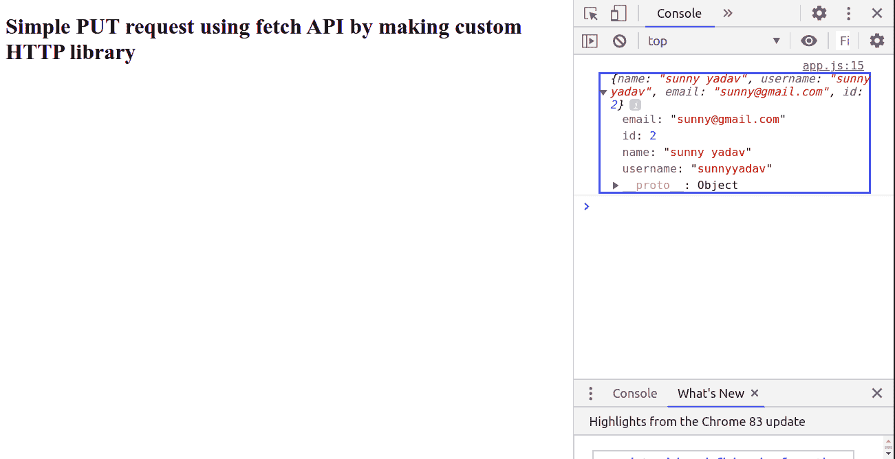

# 如何通过定制 HTTP 库，使用 fetch API 进行简单的 PUT 请求？

> 原文:[https://www . geesforgeks . org/如何通过定制 http 库来制作简单的放入请求使用提取 API/](https://www.geeksforgeeks.org/how-to-make-simple-put-request-using-fetch-api-by-making-custom-http-library/)

**fetch()** 方法用于在不刷新页面的情况下向服务器发送请求。它是 **XMLHttpRequest** 对象的替代品。它将以一个假的包含数组的应用编程接口为例，从该应用编程接口中，我们将通过定制的 HTTP 库，通过获取应用编程接口方法向**展示 PUT/Update** 数据。本教程使用的 API 是:[https://jsonplaceholder.typicode.com/users/2](https://jsonplaceholder.typicode.com/users/2)

**先决条件:**你应该了解 HTML CSS 和 JavaScript 的基础知识。

**说明:**首先我们需要创建**index.html**文件，将下面**index.html**文件的代码粘贴到里面。这个**index.html**文件包括正文标签底部的 **library.js** 和 **app.js** 文件。现在在 **library.js** 文件中，首先创建一个 **ES6 类 EasyHTTP** ，在该类中有 **async fetch()** 函数将数据放入 api url。等待有两个阶段。先为 **fetch()** 然后为其响应。无论我们收到什么响应，我们都将其返回到 **app.js** 文件中的调用函数。

现在在 **app.js** 文件中首先实例化 **EasyHTTP** 类。然后通过放原型函数，将 url 发送到 **library.js** 文件。此外，还有两个问题有待解决。第一个用于任何响应数据，第二个用于任何错误。

**文件名:index.html**

```html
<!DOCTYPE html>
<html lang="en">

<head>
    <meta charset="UTF-8">
    <meta name="viewport" content=
        "width=device-width, initial-scale=1.0">
    <meta http-equiv="X-UA-Compatible"
            content="ie=edge">
    <title>PUT Request</title>
</head>

<body>
    <h1>
        Simple PUT request using fetch API 
        by making custom HTTP library
    </h1>

    <!-- Including library.js and app.js -->
    <script src="library.js"></script>
    <script src="app.js"></script>
</body>

</html>
```

**文件名:library.html**

```html
// ES6 class
class EasyHTTP {

   // Make an HTTP PUT Request
   async put(url, data) {

    // Awaiting fetch which contains method,
    // headers and content-type and body
    const response = await fetch(url, {
      method: 'PUT',
      headers: {
        'Content-type': 'application/json'
      },
      body: JSON.stringify(data)
    });

    // Awaiting response.json()
    const resData = await response.json();

    // Return response data 
    return resData;
  }
}
```

**文件名:app.html**

```html
// Instantiating new EasyHTTP class
const http = new EasyHTTP;
// User Data
const data = {
    name: 'sunny yadav',
    username: 'sunnyyadav',
    email: 'sunny@gmail.com'
  }

// Update Post
http.put(
'https://jsonplaceholder.typicode.com/users/2',
     data)

// Resolving promise for response data
.then(data => console.log(data))

// Resolving promise for error
.catch(err => console.log(err));
```

**输出:**在浏览器中打开**index.html**文件，然后**右键- >检查元素- >控制台**。
对于 **PUT** 请求，您将看到以下输出。

