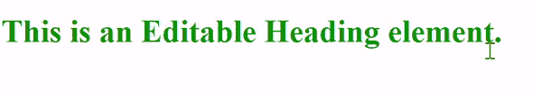
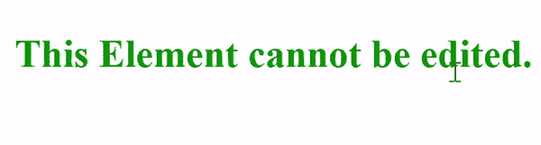
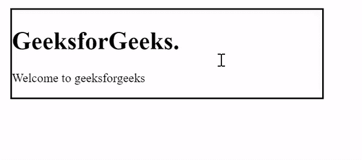

# 如何让自己的内容在 HTML 中可编辑？

> 原文:[https://www . geesforgeks . org/如何在 html 中编辑您的内容/](https://www.geeksforgeeks.org/how-to-make-your-content-editable-in-html/)

在本文中，我们将看到如何使用 HTML 使内容可编辑。要编辑 HTML 中的内容，我们将使用[**content editable**](https://www.geeksforgeeks.org/html-contenteditable-attribute/)**属性**。*****content editable*用于指定用户是否可以编辑元素的内容。****

******语法:******

```html
**<element contenteditable="true|false">**
```

****该属性有两个值。****

*   ******真:**如果*内容可编辑*属性的值设置为*真*，则该元素可编辑。****
*   ******假:**如果*内容可编辑*属性的值设置为*假*，则该元素无法编辑。****

******注意:**如果给定的属性没有值，如<h1 content editable>GEEKSFORGEEKS</h1>，其值将被视为空字符串，空字符串将被视为 *true* 。****

******示例 1:** 在本例中，我们将创建一个标题元素，其*内容可编辑*属性的值设置为*真*。****

## ****超文本标记语言****

```html
**<!DOCTYPE html>
<html>
  <head>
    <style>
      h1 {
        color: green;
      }
    </style>
  </head>
  <body>
    <h1 contenteditable="true">
      This is an Editable Heading element.
    </h1>
  </body>
</html>**
```

******输出:******

********

******示例 2:** 在本例中，整个代码将是相同的，我们只需将 *contenteditable* 属性的值更改为 *false* 。****

## ****超文本标记语言****

```html
**<!DOCTYPE html>
<html>
  <head>
    <style>
      h1 {
        color: green;
      }
    </style>
  </head>
  <body>
    <h1 contenteditable="false">
      This is element cannot be edited.
    </h1>
  </body>
</html>**
```

******输出:******

********

******示例 3:** 在本例中，我们没有为 *contenteditable* 属性提供任何值。如果*内容可编辑*属性缺失或其值无效，则它的值从其父元素继承:因此，如果其父元素是可编辑的，则该元素是可编辑的。****

## ****超文本标记语言****

```html
**<!DOCTYPE html>
<html>
  <head>
    <style>
      h1 {
        color: green;
      }
    </style>
  </head>
  <body>
    <h1 contenteditable>GeeksforGeeks.</h1>
  </body>
</html>**
```

******输出:******

********

******例 4:******

## ****超文本标记语言****

```html
**<!DOCTYPE html>
<html>
  <head>
    <style>
      div {
        width: 400px;
        border: 2px solid black;
      }
    </style>
  </head>
  <body>
    <div contenteditable="true">
      <h1>GeeksforGeeks.</h1>
      <p>Welcome to geeksforgeeks</p>

    </div>
  </body>
</html>**
```

******输出:******

********