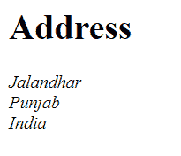

# 如何在 HTML 中标注邮政地址？

> 原文:[https://www . geesforgeks . org/how-to-markup-post-address-in-html/](https://www.geeksforgeeks.org/how-to-markup-postal-address-in-html/)

在本文中，我们将学习如何在 [HTML](https://www.geeksforgeeks.org/html-tutorials/) 中标记邮政[地址](https://www.geeksforgeeks.org/html-address-tag/)。

**方法:** [HTML](https://www.geeksforgeeks.org/html-tutorials/) 是一种用于设计网页的标记语言。它有这么多标签，可以用于不同的目的。所以，对于这一点，我们可以使用 [**<地址>**](https://www.geeksforgeeks.org/html-address-tag/) 标记。 **<地址>** 标签可用于添加任何类型的联系信息。这个标签可以用来存储地址。这个标签是在 HTML3 中引入的，在 HTML5 中仍然存在。

**语法:**

*   在您想要插入任何地址的地方添加 **<地址>** 标签。

```html
<address>
  Address content...
</address>
```

*   现在在 **<地址>** 标签内添加您的地址，并在每行末尾添加 **< br >** 标签，如下所示。

## 超文本标记语言

```html
<address>
  Jalandhar <br> <!-- Added City -->
  Punjab <br> <!-- Added State -->
  India <br> <!-- Added Country -->
  Ph: 1234567890 <br> <!-- Added Phone -->
</address>
```

*   有许多方法可以在 HTML 中标记邮政地址，我们已经展示了最简单的方法。

**示例:**

## 超文本标记语言

```html
<!DOCTYPE html>
<html>

<body>  
  <h1>Address</h1>
  <!-- Added address tag -->
  <address>   
      <!-- Added address & <br> tag below-->
      Jalandhar<br>
      Punjab<br>
      India<br> 
  </address>  
</body>
</html>
```

**输出:**



HTML 地址标签