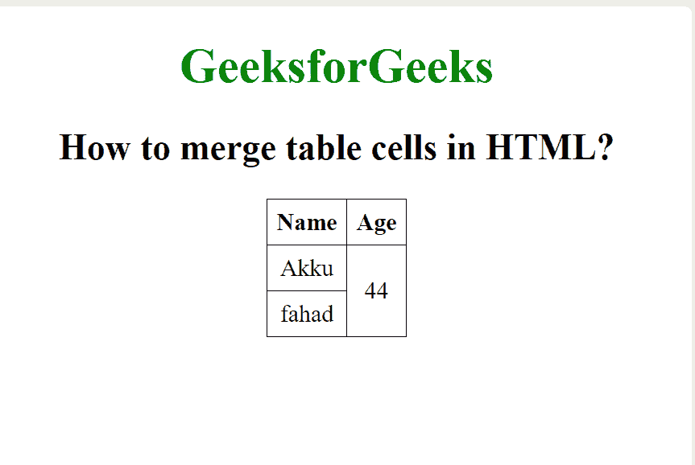
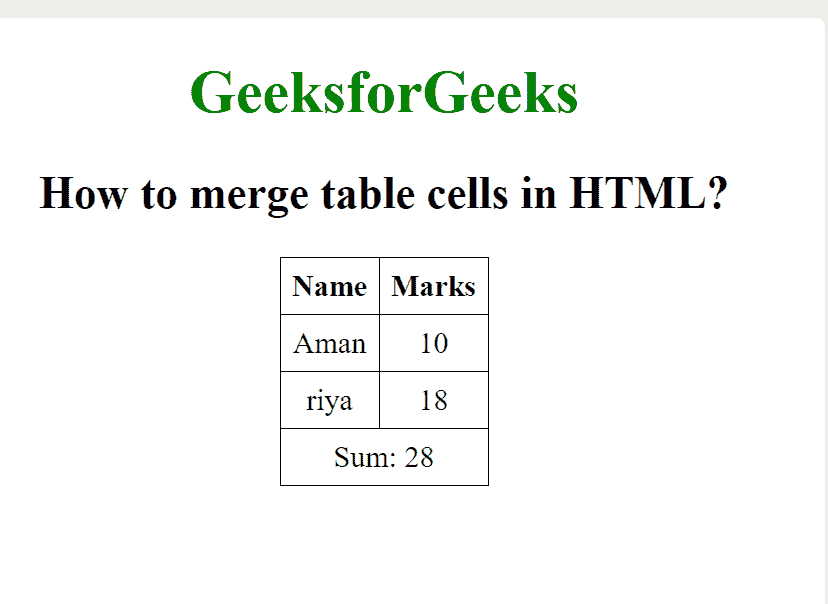

# 如何在 HTML 中合并表格单元格？

> 原文:[https://www . geeksforgeeks . org/如何合并 html 中的表格单元格/](https://www.geeksforgeeks.org/how-to-merge-table-cells-in-html/)

本文的目的是合并 HTML 中的表格单元格。可以使用 HTML 中的*****row span*****和 *c **olspan*** 属性来完成。 *rowspan* 用于合并或合并一行中的单元格数，而 *colspan* 用于合并表格中的列单元格。****

******示例 1:** 在本例中，我们将合并两个表行并制作一个单行。****

## ****超文本标记语言****

```html
**<!DOCTYPE html>
<html>

<head>
    <style>
        table,
        th,
        td {
            border: 1px solid black;
            border-collapse: collapse;
            padding: 6px;
        }
    </style>
</head>

<body style="text-align:center">

    <h1 style="color:green;">
        GeeksforGeeks
    </h1>

    <h2>How to merge table cells in HTML?</h2>

    <table align="center">
        <tr>
            <th>Name</th>
            <th>Age</th>
        </tr>
        <tr>
            <td>Akku</td>

            <!-- This cell will take up
                space on two rows -->
            <td rowspan="2">44</td>
        </tr>
        <tr>
            <td>fahad</td>
        </tr>
    </table>
</body>

</html>**
```

******输出:******

********

******示例 2:** 在本例中，我们将合并两个表列并制作一个单独的列。****

## ****超文本标记语言****

```html
**<!DOCTYPE html>
<html>

<head>
    <style>
        table,
        th,
        td {
            border: 1px solid black;
            border-collapse: collapse;
            padding: 6px;
            text-align: center;
        }
    </style>
</head>

<body>
    <center>
        <h1 style="color: green;">
            GeeksforGeeks
        </h1>

        <h2>
            How to merge table 
            cells in HTML?
        </h2>

        <table>
            <tr>
                <th>Name</tMh>
                <th>Marks</th>
            </tr>
            <tr>
                <td>Aman</td>
                <td>10</td>
            </tr>
            <tr>
                <td>riya</td>
                <td>18</td>
            </tr>
            <!-- The last row -->

            <tr>
                <!-- This td will span two 
                    columns, that is a 
                    single column will take 
                    up the space of 2 -->
                <td colspan="2">Sum: 28</td>
            </tr>
        </table>
    </center>
</body>

</html>**
```

******输出:******

********

******支持的浏览器:******

*   ****谷歌 Chrome****
*   ****微软公司出品的 web 浏览器****
*   ****火狐浏览器****
*   ****旅行队****
*   ****歌剧****