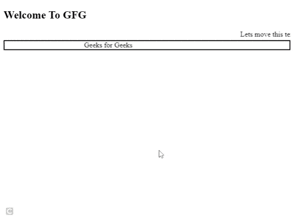

# 如何在 HTML 中移动一个文本？

> 原文:[https://www.geeksforgeeks.org/how-to-move-a-text-in-html/](https://www.geeksforgeeks.org/how-to-move-a-text-in-html/)

网站的某些内容就像一个警报或通知/信息，必须显示给每个使用网站的人。它必须放在每个人都能看到的地方。

在本文中，我们将学习如何使用 HTML [<字幕>](https://www.geeksforgeeks.org/html-marquee-tag/) 标签在您的网站上创建移动内容。HTML 中的<字幕>标签用于在网页中创建滚动文本或图像。它可以水平地从左向右或从右向左滚动，也可以垂直地从上到下或从下到上滚动。

**语法:**

```html
<marquee> Contents... </marquee>
```

**进场:**

*   在任何文本编辑器中创建一个简单的 HTML 文件。
*   在 *<选框>标签内添加想要移动的文本。*

**示例:**

## 超文本标记语言

```html
<!DOCTYPE html>
<html>

<body>
    <h2>Welcome To GFG</h2>
    <marquee> Lets Move this text.</marquee>
    <marquee direction="right" 
        behavior="alternate" 
        style="border:BLACK 2px SOLID">
        Geeks for Geeks
    </marquee>
</body>

</html>
```

**输出:**

