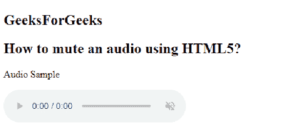

# 如何用 HTML5 静音？

> 原文:[https://www . geesforgeks . org/how-mute-audio-use-html 5/](https://www.geeksforgeeks.org/how-to-mute-audio-using-html5/)

在本文中，我们通过使用 HTML 文档的 **<音频>** 标签中的*静音*属性来静音*音频*。它用于定义网页上的音频应该静音。

**语法:**

```html
<audio controls muted>
```

**示例:**

```html
<!DOCTYPE html> 
<html> 
<head>
    <title>
        How to mute an audio using HTML5?
    </title>
</head>

<body> 
    <h2>
        GeeksForGeeks
    </h2>
    <h2>
       How to mute an audio using HTML5?
    </h2>
    <p>Audio Sample</p> 

    <audio controls muted> 
        <source src="test.mp3" type="audio/mp3"> 
        <source src="test.ogg" type="audio/ogg"> 
    </audio> 

</body> 

</html>                    
```

**输出:**

**支持的浏览器如下:**

*   谷歌 Chrome 4.0
*   Internet Explorer 9.0
*   Firefox 3.5
*   歌剧 10.5
*   Safari 4.0