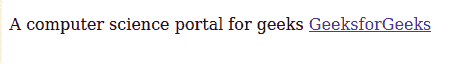
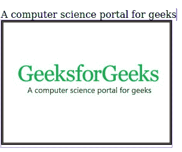

# 如何在 HTML 中打开另一个窗口或选项卡中的超链接？

> 原文:[https://www . geesforgeks . org/如何在另一个窗口中打开超链接或在 html 中打开标签/](https://www.geeksforgeeks.org/how-to-open-a-hyperlink-in-another-window-or-tab-in-html/)

有多种方法可以在另一个窗口或选项卡中打开超链接，例如使用 javaScript、jQuery 或 HTML。要使用 HTML 在另一个窗口或选项卡中打开超链接，请使用**目标**属性，并在定位选项卡中为其提供值 **_blank** 。
**语法:**

```html
<a target="target_name" rel="relation_name" href="link">Link Name</a>
```

这里 **rel** 属性用来描述当前文档和链接文档的关系， **target** 属性用来指定目标链接。
**示例 1:** 本示例在新窗口或选项卡中打开超链接。

## 超文本标记语言

```html
<!DOCTYPE html>
<html>

<head>
    <title>
        Open hyperlink in a
        new window or tab
    </title>
</head>

<body>

<p>A computer science portal for geeks
        <a target="_blank"
            href="https://www.geeksforgeeks.org/">
            GeeksforGeeks
        </a>
    </p>

</body>

</html>
```

**输出:**



**说明:**这里， **target="_blank"** 用于在新窗口或标签页中打开超链接。
**示例 2:** 使用安全措施在新窗口或标签中打开超链接。

## 超文本标记语言

```html
<!DOCTYPE html>
<html>

<head>
    <title>
        Open hyperlink in a
        new window or tab
    </title>
</head>

<body>

<p>A computer science portal for geeks
        <a target="_blank" rel="noopener noreferrer"
            href="https://www.geeksforgeeks.org/">
            GeeksforGeeks
        </a>
    </p>

</body>

</html>
```

**输出:**


**说明:**在这里， **rel="noopener noreferrer"** 被用作安全措施。
**示例 3:** 在新窗口或选项卡中打开图像超链接。

## 超文本标记语言

```html
<!DOCTYPE html>
<html>

<head>
    <title>
        Open hyperlink in a
        new window or tab
    </title>
</head>

<body>

<p>A computer science portal for geeks
        <a target="_blank" rel="noopener noreferrer"
                href="https://www.geeksforgeeks.org/">

            
        </a>
    </p>

</body>

</html>
```

**输出:**

