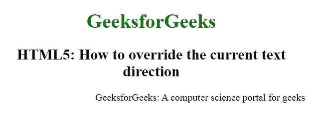
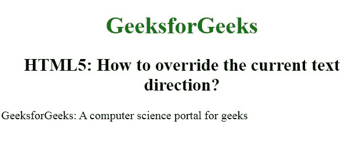

# 如何用 HTML 覆盖当前文本方向？

> 原文:[https://www . geeksforgeeks . org/如何使用 html 覆盖当前文本方向/](https://www.geeksforgeeks.org/how-to-override-the-current-text-direction-using-html/)

在本文中，我们将通过在特定元素中使用 dir 属性来覆盖当前的文本方向。它用于指定元素内容的文本方向。
包含三个值:

*   **ltr:** 为默认值。该值代表从左到右文本方向的文本。
*   **rtl:** 该值代表从右向左文本方向的文本。
*   **自动:**让浏览器根据内容算出文字方向。

**语法:**

```html
<element dir = "ltr | rtl | auto">
```

**例 1:**

```html
<!DOCTYPE html>
<html>

<head>
    <title>
        Override the current 
        text direction
    </title>

    <style>
        h1 {
            color: green;
        }

        h1,
        h2 {
            text-align: center;
        }
    </style>
</head>

<body>
    <h1>GeeksforGeeks</h1>

    <h2>
        HTML5: How to override 
        the current text direction?
    </h2>

    <p dir="rtl">
        GeeksforGeeks: A computer 
        science portal for geeks
    </p>
</body>

</html>
```

**输出:**


**例 2:**

```html
<!DOCTYPE html>
<html>

<head>
    <title>
        Override the current 
        text direction
    </title>

    <style>
        h1 {
            color: green;
        }

        h1,
        h2 {
            text-align: center;
        }
    </style>
</head>

<body>
    <h1>GeeksforGeeks</h1>

    <h2>
        HTML5: How to override 
        the current text direction?
    </h2>

    <p dir="ltr">
        GeeksforGeeks: A computer 
        science portal for geeks
    </p>
</body>

</html>
```

**输出:**


**支持的浏览器:**

*   谷歌 Chrome
*   微软公司出品的 web 浏览器
*   火狐浏览器
*   歌剧
*   旅行队